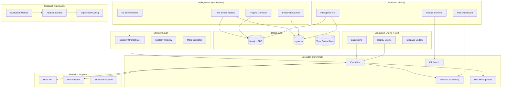

# Design Document: Algorithmic Trading System

## Overview

This document presents the design for a full-stack, research-grade algorithmic trading system optimized for master's thesis research. The system prioritizes intelligence completeness and academic rigor while maintaining strict separation between research intelligence and capital deployment through enforced architectural boundaries.

The design follows a "research system that can trade" philosophy rather than a "trading system that happens to do research," emphasizing interpretability, reproducibility, and comprehensive evaluation capabilities.

## Architecture

### High-Level Architecture



### Core Design Principles

1. **Sandboxing**: Intelligence layer provides advisory outputs only; execution core retains final authority
2. **Determinism**: All components support deterministic replay for academic evaluation
3. **Separation of Concerns**: Clear boundaries between structural knowledge (Neo4j) and latent representations (pgvector)
4. **Interpretability**: All intelligence outputs must be explainable and traceable
5. **Reproducibility**: Complete experiment versioning and configuration management

## Components and Interfaces

### Intelligence Layer (Python)

The intelligence layer implements three core pipelines that transform market data into actionable insights while maintaining academic rigor.

#### Time-Series → Embeddings Pipeline

**Purpose**: Convert raw market data into compressed latent representations for similarity analysis and memory.

**Components**:
- **Feature Canonicalization Layer**: Deterministic feature extraction from OHLCV data
- **Embedding Model**: Temporal CNN, Transformer encoder, or VAE for representation learning
- **Embedding Materialization**: Storage in pgvector with versioning and metadata

**Input**: Clean, versioned OHLCV data with rolling windows (32/64/128 bars)
**Output**: Fixed-length embeddings (128-256 dimensions) stored in `market_state_embeddings`

**Key Features**:
- Immutable embeddings with version control
- Multiple embeddings per timestamp for different horizons
- Retrospective similarity queries to prevent lookahead bias

#### Regime Inference & Update Pipeline

**Purpose**: Generate discrete, interpretable market state labels from continuous data.

**Components**:
- **Regime Candidate Generation**: HMM, clustering, or rule-based classification
- **Regime Stabilization Logic**: Minimum duration and hysteresis to prevent flickering
- **Regime Graph Update**: Incremental updates to Neo4j transition probabilities

**Input**: Recent embeddings, realized volatility, trend diagnostics
**Output**: Stable regime labels and transition probabilities in Neo4j

**Key Features**:
- Learned regime Markov graph with empirical transition probabilities
- Asset-specific sensitivity attribution via `SENSITIVE_TO` relationships
- Explicit transition uncertainty quantification

#### Graph Metrics → Feature Materialization Pipeline

**Purpose**: Extract structural intelligence from Neo4j graphs for downstream learning.

**Components**:
- **Graph Projections**: Time-windowed projections using Neo4j GDS
- **Graph Algorithms**: Louvain clustering, centrality measures, entropy calculations
- **Feature Extraction**: Materialized graph features for RL and strategy selection

**Input**: Neo4j graph relationships and node properties
**Output**: `GraphFeatureSnapshot` objects with structural intelligence

**Key Features**:
- Versioned graph projections for reproducibility
- Systematic risk and contagion channel identification
- Strategy diversification metrics

### Execution Core (Rust)

The execution core provides the foundational infrastructure for safe, auditable trading operations.

**Components**:
- **Event Bus**: Central message passing with deterministic ordering
- **Portfolio Accounting**: Real-time position tracking and P&L calculation
- **Risk Management**: Configurable guardrails and automatic halt mechanisms
- **Global Kill Switch**: Emergency shutdown capability

**Key Interfaces**:
```rust
pub trait ExecutionCore {
    fn process_order_intent(&mut self, intent: OrderIntent) -> Result<OrderId>;
    fn update_position(&mut self, fill: Fill) -> Result<()>;
    fn check_risk_limits(&self) -> RiskStatus;
    fn emergency_halt(&mut self) -> Result<()>;
}
```

### Strategy Orchestration Layer

Converts intelligence outputs into trade intents while maintaining sandboxing constraints.

**Components**:
- **Strategy Registry**: Manages multiple strategy definitions and parameters
- **Strategy Selection**: Regime-aware strategy weighting and allocation
- **Meta Controller**: Sandboxed RL agent for strategy orchestration
- **Policy Evaluation**: Performance monitoring and attribution

**Key Constraint**: Outputs trade intents only, never direct orders

### Simulation Engine (Rust)

Provides deterministic backtesting and scenario analysis capabilities.

**Components**:
- **Event-Driven Backtesting**: Realistic order processing simulation
- **Slippage and Latency Models**: Market impact and execution delay simulation
- **Scenario Injection**: Crisis scenarios, gaps, and trading halts
- **Deterministic Clock**: Consistent time management across components

**Key Features**:
- Complete audit trail for academic evaluation
- Configurable market microstructure models
- Stress testing capabilities

## Data Models

### Neo4j Schema (Structural Knowledge)

#### Node Types

**Asset**
```cypher
(:Asset {
    asset_id: string,        // EURUSD, BTCUSD, SP500
    asset_class: string,     // FX, Equity, Crypto, Commodity
    venue: string,           // Deriv, MT5 broker, Exchange
    base_currency: string,
    quote_currency: string
})
```

**MarketRegime**
```cypher
(:MarketRegime {
    regime_id: string,
    volatility_level: enum,  // low, medium, high
    trend_state: enum,       // trending, ranging
    liquidity_state: enum,   // normal, stressed
    description: string
})
```

**Strategy**
```cypher
(:Strategy {
    strategy_id: string,
    family: string,          // trend, mean_reversion, volatility
    horizon: string,         // intraday, daily
    description: string
})
```

**IntelligenceSignal**
```cypher
(:IntelligenceSignal {
    signal_id: string,
    type: string,            // regime_label, correlation_shift
    confidence: float,
    timestamp: datetime
})
```

#### Relationship Types

**Asset Correlations**
```cypher
(:Asset)-[:CORRELATED {
    window: string,
    strength: float,
    sign: int
}]->(:Asset)
```

**Regime Transitions**
```cypher
(:MarketRegime)-[:TRANSITIONS_TO {
    probability: float,
    avg_duration: float
}]->(:MarketRegime)
```

**Strategy Performance**
```cypher
(:Strategy)-[:PERFORMS_IN {
    sharpe: float,
    max_dd: float,
    sample_size: int
}]->(:MarketRegime)
```

### pgvector Schema (Latent State Memory)

#### Market State Embeddings
```sql
CREATE TABLE market_state_embeddings (
    id UUID PRIMARY KEY,
    timestamp TIMESTAMPTZ NOT NULL,
    asset_id TEXT,
    regime_id TEXT,
    embedding VECTOR(256),
    volatility REAL,
    liquidity REAL,
    horizon TEXT,
    source_model TEXT,
    metadata JSONB
);

CREATE INDEX ON market_state_embeddings 
USING ivfflat (embedding vector_cosine_ops) 
WITH (lists = 100);
```

#### Strategy State Embeddings
```sql
CREATE TABLE strategy_state_embeddings (
    id UUID PRIMARY KEY,
    timestamp TIMESTAMPTZ,
    strategy_id TEXT,
    embedding VECTOR(128),
    pnl_state REAL,
    drawdown REAL,
    exposure REAL,
    metadata JSONB
);
```

#### Regime Trajectory Embeddings
```sql
CREATE TABLE regime_trajectory_embeddings (
    id UUID PRIMARY KEY,
    start_time TIMESTAMPTZ,
    end_time TIMESTAMPTZ,
    embedding VECTOR(128),
    realized_vol REAL,
    transition_path JSONB
);
```

### Composite Intelligence State

The final output consumed by downstream systems:

```python
@dataclass
class IntelligenceState:
    embedding_similarity_context: List[SimilarityMatch]
    current_regime_label: str
    regime_transition_probabilities: Dict[str, float]
    graph_structural_features: GraphFeatureSnapshot
    confidence_scores: Dict[str, float]
    timestamp: datetime
```

## Formal System Specifications

### Reinforcement Learning Environment Definition

#### Environment Type and Structure
- **Type**: Episodic, partially observable MDP
- **Step Size**: Strategy decision interval (every N bars)
- **Episode**: Fixed horizon or regime-bounded
- **Role**: Meta-policy controller for capital allocation, NOT direct trading

#### State Space Formal Definition

The RL state is composite, structured, and low-dimensional:

```python
S_t = [
    E_t,  # Latent market embedding (ℝ^128)
    R_t,  # Discrete regime representation
    G_t,  # Graph structural features
    P_t,  # Portfolio & risk state
    C_t   # Confidence & uncertainty
]
```

**1. Latent Market Context (pgvector)**
```python
E_t ∈ ℝ^128  # Current market state embedding
# Optionally concatenated with:
# - Mean of k-nearest historical embeddings
# - Embedding dispersion score
```

**2. Regime State (Neo4j)**
```python
R_t = [
    regime_id,              # One-hot encoded
    transition_probabilities, # Vector of transition probs
    regime_entropy          # Scalar uncertainty measure
]
```

**3. Graph Structural Features (Neo4j GDS)**
```python
G_t = [
    asset_cluster_id,       # Cluster membership
    cluster_density,        # Intra-cluster connectivity
    centrality_score,       # Node importance
    systemic_risk_proxy     # Contagion risk measure
]
```

**4. Portfolio & Risk State (Rust Core)**
```python
P_t = [
    net_exposure,           # Current net position
    gross_exposure,         # Total position size
    drawdown,              # Current drawdown level
    volatility_target_utilization  # Risk budget usage
]
```

**5. Confidence & Uncertainty**
```python
C_t = [
    regime_confidence,      # Regime classification confidence
    embedding_similarity_score,  # Historical similarity
    forecast_dispersion     # Prediction uncertainty
]
```

#### Action Space Definition

Continuous but bounded action space:

```python
A_t = [
    w_1, w_2, ..., w_n,    # Strategy weights (Σwᵢ = 1)
    exposure_multiplier,    # Global risk throttle ∈ [0, 1]
    execution_aggressiveness  # ∈ {low, medium, high}
]
```

#### Reward Function

Risk-adjusted system quality reward:

```python
R_t = α·Sharpe_t - β·DrawdownPenalty_t - γ·TurnoverCost_t - δ·RegimeViolationPenalty_t
```

Where `RegimeViolationPenalty` activates when behavior contradicts regime knowledge.

#### Termination Conditions
- Max drawdown breached
- Regime shift exceeds stability threshold  
- Data exhaustion

### Embedding Model Architecture and Training

#### Model Architecture Selection

**Primary**: Temporal Convolutional Network (TCN)
- Stable training characteristics
- Causal structure preservation
- Interpretable receptive fields
- Excellent regime structure capture

**Secondary**: Variational Autoencoder (for thesis comparison)

#### Input Tensor Specification

```python
X ∈ ℝ^{T × F}
# Where:
# T = rolling window (64 time steps)
# F = engineered features (returns, volatility, liquidity, correlations)
```

#### Training Objective and Protocol

**Self-supervised representation learning** with multiple loss components:

```python
Loss = λ₁·ReconstructionLoss + λ₂·ContrastiveLoss + λ₃·TemporalSmoothnessLoss
```

**Training Protocol**:
1. Offline training only on pre-cut historical segments
2. Freeze weights before simulation (no online learning)
3. Version and hash all models for reproducibility
4. Validate via embedding stability, regime separability, and similarity coherence

#### Output Validation Requirements

Embeddings must satisfy:
- **Temporal continuity**: Similar market conditions produce similar embeddings
- **Regime separability**: Different regimes cluster distinctly in embedding space
- **Similarity interpretability**: Embedding distance correlates with market similarity

### Neo4j Graph Data Science Job Definitions

#### Asset Correlation Graph

```cypher
-- Graph Projection
CALL gds.graph.project(
    'assetGraph',
    'Asset',
    {
        CORRELATED: {
            properties: 'strength'
        }
    }
)

-- Algorithms
CALL gds.louvain.stream('assetGraph')  -- Market clustering
CALL gds.degree.stream('assetGraph')   -- Systemic exposure
CALL gds.betweenness.stream('assetGraph')  -- Contagion risk
```

#### Regime Transition Graph

```cypher
-- Graph Projection
CALL gds.graph.project(
    'regimeGraph',
    'MarketRegime',
    {
        TRANSITIONS_TO: {
            properties: 'probability'
        }
    }
)

-- Algorithms
CALL gds.pageRank.stream('regimeGraph')  -- Dominant regimes
-- Path enumeration for crisis trajectories
-- Entropy calculation for regime stability
```

#### Strategy-Regime Performance Graph

```cypher
-- Bipartite graph analysis
-- Weighted ranking algorithms
-- Community detection for strategy clustering
```

#### Materialization Rules

All GDS outputs are:
1. Written back to Neo4j as node properties
2. Snapshot-exported to Parquet for feature stores
3. Never queried synchronously during trading operations

### FastAPI Intelligence Service Architecture

#### Service Role and Boundaries

FastAPI serves as the **intelligence boundary**, not the control plane. It provides stateless, deterministic intelligence services.

#### Core Endpoint Specifications

**1. Embedding Inference**
```python
@app.post("/intelligence/embedding")
async def infer_embedding(features: MarketWindowFeatures) -> EmbeddingResponse:
    return EmbeddingResponse(
        embedding_id=str,
        similarity_context=List[SimilarityMatch],
        confidence_score=float
    )
```

**2. Regime Inference**
```python
@app.post("/intelligence/regime")
async def infer_regime(context: MarketContext) -> RegimeResponse:
    return RegimeResponse(
        regime_probabilities=Dict[str, float],
        transition_likelihoods=Dict[str, float],
        regime_entropy=float
    )
```

**3. Graph Features**
```python
@app.get("/intelligence/graph-features")
async def get_graph_features(asset_id: str) -> GraphFeaturesResponse:
    return GraphFeaturesResponse(
        cluster_membership=str,
        centrality_metrics=Dict[str, float],
        systemic_risk_proxies=Dict[str, float]
    )
```

**4. RL State Assembly**
```python
@app.get("/intelligence/state")
async def assemble_rl_state(context: SystemContext) -> RLStateResponse:
    return RLStateResponse(
        composite_state=IntelligenceState,
        state_components=Dict[str, Any],
        assembly_metadata=Dict[str, Any]
    )
```

#### Non-Functional Requirements

- **Stateless endpoints**: No session state maintained
- **Deterministic responses**: Identical inputs produce identical outputs
- **Strict version headers**: All responses include model/schema versions
- **Full request logging**: Complete audit trail for reproducibility
- **No trading capabilities**: Intelligence boundary enforcement

## Admin Application Frontend Architecture

### Design Philosophy and Principles

The admin application follows a formal nLVE (List-View-Edit) framework optimized for intelligence-centric trading platform management:

#### Core Design Principles

1. **One Mental Model Per Screen**: Never mix strategy logic, intelligence state, and execution outcomes
2. **Read-First, Edit-Second**: Most admin users observe; few modify. Edits are gated and intentional
3. **Context Flow Left → Right**: Sidebar (domain) → List (instances) → View (state) → Edit (intent)
4. **Complete Provenance**: Every edit has attribution and reversibility with full audit trails
5. **Cognitive Load Control**: Clear domain boundaries prevent information overload

### Sidebar Navigation Structure

Domain-driven navigation with nine primary sections:

```typescript
interface SidebarNavigation {
  dashboard: DashboardSection;
  markets: MarketsSection;
  intelligence: IntelligenceSection;  // Core thesis layer
  strategies: StrategiesSection;
  portfolioRisk: PortfolioRiskSection;
  execution: ExecutionSection;
  simulation: SimulationSection;
  dataModels: DataModelsSection;
  system: SystemSection;
}
```

### Intelligence Domain Interface (Core Thesis Layer)

#### List Views
- **Market States**: Current and historical market state embeddings
- **Regimes**: Detected market regimes with transition probabilities
- **Intelligence Signals**: Generated signals with confidence scores
- **Graph Snapshots**: Neo4j graph analysis results

#### View Panel (Regime Selected)
```typescript
interface RegimeViewPanel {
  regimeDefinition: {
    volatilityLevel: 'low' | 'medium' | 'high';
    trendState: 'trending' | 'ranging';
    liquidityState: 'normal' | 'stressed';
    description: string;
  };
  transitionProbabilities: Record<string, number>;
  durationStatistics: {
    averageDuration: number;
    minDuration: number;
    maxDuration: number;
  };
  affectedAssets: AssetSensitivity[];
  strategyPerformance: StrategyPerformanceMetrics[];
}
```

#### Edit Tabs (Regime Configuration)
```typescript
interface RegimeEditTabs {
  definition: RegimeDefinitionTab;      // Interpretable regime attributes
  transitionRules: TransitionRulesTab;  // Stability thresholds
  graphContext: GraphContextTab;        // Linked Neo4j nodes
  validation: ValidationTab;            // Confusion & persistence metrics
  audit: AuditTab;                     // Version history
}
```

### Strategy Management Interface

#### List Views
- **Strategy Catalog**: All available strategies with status
- **Strategy Groups**: Logical groupings for portfolio allocation

#### View Panel (Strategy Selected)
```typescript
interface StrategyViewPanel {
  description: string;
  family: 'trend' | 'mean_reversion' | 'volatility';
  horizon: 'intraday' | 'daily' | 'weekly';
  enabledMarkets: Asset[];
  historicalPerformance: PerformanceMetrics;
  regimeAffinity: Record<string, number>;
}
```

#### Edit Tabs (Strategy Configuration)
```typescript
interface StrategyEditTabs {
  definition: StrategyDefinitionTab;    // Strategy intent (no params)
  parameters: ParametersTab;           // Bounded, validated inputs
  regimeConstraints: RegimeConstraintsTab; // Enable/disable by regime
  riskBudget: RiskBudgetTab;          // Max allocation
  backtests: BacktestsTab;            // Linked experiments
  audit: AuditTab;                    // Change history
}
```

### Portfolio & Risk Management Interface

#### View Panel (Risk Policy Selected)
```typescript
interface RiskPolicyViewPanel {
  exposureLimits: {
    maxNetExposure: number;
    maxGrossExposure: number;
    maxSinglePosition: number;
  };
  drawdownRules: {
    maxDrawdown: number;
    dailyLossLimit: number;
    volatilityScaling: boolean;
  };
  killSwitchConditions: KillSwitchCondition[];
}
```

### Execution Management Interface

#### View Panel (Adapter Selected)
```typescript
interface ExecutionAdapterViewPanel {
  connectivityStatus: 'connected' | 'disconnected' | 'error';
  latencyMetrics: {
    averageLatency: number;
    p95Latency: number;
    p99Latency: number;
  };
  rejectionRates: {
    totalOrders: number;
    rejectedOrders: number;
    rejectionRate: number;
  };
  orderFlow: RecentOrderActivity[];
}
```

### Simulation & Experiments Interface

#### View Panel (Experiment Selected)
```typescript
interface ExperimentViewPanel {
  objective: string;
  dataRange: {
    startDate: Date;
    endDate: Date;
    assets: Asset[];
  };
  modelsUsed: ModelConfiguration[];
  summaryMetrics: ExperimentMetrics;
  status: 'running' | 'completed' | 'failed' | 'queued';
}
```

### Data & Models Interface

#### View Panel (Model Selected)
```typescript
interface ModelViewPanel {
  architecture: {
    modelType: 'TCN' | 'VAE' | 'Transformer';
    parameters: number;
    inputDimensions: number;
    outputDimensions: number;
  };
  trainingData: {
    dataset: string;
    dateRange: DateRange;
    features: string[];
  };
  validationMetrics: ValidationMetrics;
  deploymentStatus: 'active' | 'inactive' | 'deprecated';
}
```

### Edit Panel UX Rules

Global rules applying to all edit interfaces:

1. **Staged Edits**: All changes are staged, not applied live
2. **Diff Views**: Show changes before persistence with clear before/after comparison
3. **Validation**: Comprehensive validation before any persistence
4. **Impact Explanation**: Plain language explanation of change consequences
5. **Event Generation**: Every edit produces a complete audit event

### Component Architecture

```typescript
// Base nLVE Framework Components
interface nLVEFramework {
  Sidebar: SidebarComponent;
  ListView: ListViewComponent<T>;
  ViewPanel: ViewPanelComponent<T>;
  EditPanel: EditPanelComponent<T>;
  AuditTrail: AuditTrailComponent;
}

// Domain-Specific Components
interface DomainComponents {
  IntelligenceComponents: IntelligenceDomainComponents;
  StrategyComponents: StrategyDomainComponents;
  RiskComponents: RiskDomainComponents;
  ExecutionComponents: ExecutionDomainComponents;
  SimulationComponents: SimulationDomainComponents;
}
```

This architecture ensures clear separation of concerns, maintains academic rigor through comprehensive audit trails, and provides intuitive navigation for complex intelligence-centric trading operations.

## Correctness Properties

*A property is a characteristic or behavior that should hold true across all valid executions of a system—essentially, a formal statement about what the system should do. Properties serve as the bridge between human-readable specifications and machine-verifiable correctness guarantees.*

Based on the prework analysis, the following properties validate the system's correctness across all valid executions:

### Property 1: Intelligence Output Format Compliance
*For any* intelligence component output, the output should conform to one of the specified types: forecast distributions, regime labels, confidence scores, or suggested actions.
**Validates: Requirements 1.3**

### Property 2: Intelligence Layer Sandboxing
*For any* intelligence component, it should have no direct access to order placement functions and should only produce advisory outputs.
**Validates: Requirements 1.4, 4.4**

### Property 3: Emergency Kill Switch Effectiveness
*For any* system state, activating the global kill switch should immediately halt all trading activity across all components.
**Validates: Requirements 1.6**

### Property 4: Neo4j Schema Completeness
*For any* Neo4j node or relationship, it should conform to the specified schema with all required properties and correct data types.
**Validates: Requirements 2.9, 2.10, 11.1-11.10**

### Property 5: pgvector Schema Completeness
*For any* pgvector table, it should have all required columns with correct data types and appropriate vector indexing.
**Validates: Requirements 2.11, 11.11-11.14**

### Property 6: Composite RL State Completeness
*For any* RL state construction, the state should contain embeddings from pgvector, regime labels from Neo4j, transition probabilities from Neo4j, strategy performance context from Neo4j, and risk metrics from Rust components.
**Validates: Requirements 2.12, 11.15, 12.7-12.10**

### Property 7: RL Environment MDP Compliance
*For any* RL environment episode, the state transitions should follow the episodic MDP structure with proper action space constraints and reward function calculations.
**Validates: Requirements 12.1-12.6**

### Property 8: Embedding Model Validation
*For any* trained embedding model, the outputs should satisfy temporal continuity, regime separability, and similarity interpretability before deployment.
**Validates: Requirements 13.9-13.10**

### Property 9: Embedding Training Protocol Compliance
*For any* embedding model training session, it should use offline training on pre-cut segments with frozen weights and complete versioning.
**Validates: Requirements 13.6-13.8**

### Property 10: Neo4j GDS Algorithm Execution
*For any* GDS algorithm execution, the results should be materialized as node properties and Parquet exports without synchronous trading queries.
**Validates: Requirements 14.10-14.11**

### Property 11: FastAPI Intelligence Service Statefulness
*For any* FastAPI intelligence endpoint, the service should remain stateless with deterministic responses and complete audit logging.
**Validates: Requirements 15.1, 15.6-15.7**

### Property 12: Deterministic Replay Consistency
*For any* historical scenario, replaying the same scenario with identical parameters should produce identical results across all system components.
**Validates: Requirements 3.3**

### Property 13: Temporal Data Isolation
*For any* simulation timestamp, no component should have access to data from future timestamps, preventing lookahead bias.
**Validates: Requirements 3.6**

### Property 14: Deterministic Clock Consistency
*For any* time progression operation, the deterministic clock should advance consistently and repeatably across system restarts.
**Validates: Requirements 3.7**

### Property 15: Execution Adapter Normalization
*For any* trade intent, processing through different execution adapters should produce equivalent normalized results.
**Validates: Requirements 5.3**

### Property 16: Shadow Execution Isolation
*For any* order processed in shadow execution mode, no actual trade should be executed while maintaining complete order processing simulation.
**Validates: Requirements 5.4**

### Property 17: Live-Simulation State Synchronization
*For any* live trading operation, the corresponding simulation state should remain synchronized with the live state.
**Validates: Requirements 5.5**

### Property 18: Risk Limit Enforcement
*For any* risk limit breach, the system should automatically prevent further trading and trigger appropriate alerts.
**Validates: Requirements 6.2, 6.4**

### Property 19: Complete Audit Trail
*For any* order or fill, all required audit information should be logged with complete metadata and timestamps.
**Validates: Requirements 6.3, 7.6**

### Property 20: Experiment Reproducibility
*For any* experiment configuration, running identical configurations should produce identical results across different executions.
**Validates: Requirements 7.5**

### Property 21: Real-time Dashboard Updates
*For any* underlying data change, the frontend dashboard should reflect the update in real-time.
**Validates: Requirements 8.4**

### Property 22: Data Validation and Error Handling
*For any* input data, invalid data should be rejected with appropriate error messages while valid data should be processed successfully, and missing data should be handled gracefully without system crashes.
**Validates: Requirements 9.3, 9.5**

### Property 23: Health Check Accuracy
*For any* system component state, health check endpoints should accurately reflect the actual component status.
**Validates: Requirements 10.2**

### Property 24: Graceful Shutdown Completeness
*For any* shutdown procedure, all components should complete shutdown without data loss or corruption.
**Validates: Requirements 10.5**

### Property 25: Admin Application nLVE Framework Compliance
*For any* admin interface navigation, the system should maintain clear domain boundaries and enforce read-first, edit-second principles with complete provenance tracking.
**Validates: Requirements 16.4-16.9**

### Property 26: Intelligence Domain Interface Completeness
*For any* intelligence artifact (regime, market state, signal), the interface should provide complete lineage, provenance, and validation information with appropriate edit controls.
**Validates: Requirements 17.6-17.7**

### Property 27: Strategy and Risk Interface Validation
*For any* strategy or risk policy configuration, the interface should validate parameters against system constraints and regime compatibility before persistence.
**Validates: Requirements 18.7**

### Property 28: Execution and System Interface Security
*For any* execution or system configuration change, the interface should enforce security policies and change approval workflows with complete audit trails.
**Validates: Requirements 19.7**

### Property 29: Simulation and Data Interface Reproducibility
*For any* experiment or data artifact management, the interface should maintain complete reproducibility and lineage tracking with version control.
**Validates: Requirements 20.7**

## Error Handling

The system implements comprehensive error handling across all layers:

### Intelligence Layer Error Handling
- **Model Failures**: Graceful degradation when ML models fail, with fallback to simpler heuristics
- **Data Quality Issues**: Automatic detection and handling of missing, corrupted, or anomalous data
- **Regime Detection Failures**: Fallback to default regime assumptions when detection fails
- **Embedding Generation Errors**: Retry mechanisms with exponential backoff

### Execution Core Error Handling
- **Order Rejection**: Proper handling of broker rejections with retry logic and alerting
- **Connection Failures**: Automatic reconnection with circuit breaker patterns
- **Risk Limit Breaches**: Immediate halt with detailed logging and operator notification
- **Portfolio Accounting Errors**: Data integrity checks with automatic reconciliation

### Simulation Engine Error Handling
- **Data Gaps**: Interpolation strategies for missing historical data
- **Scenario Injection Failures**: Graceful handling of invalid scenario parameters
- **Replay Inconsistencies**: Detection and reporting of non-deterministic behavior

### System-Wide Error Handling
- **Component Failures**: Isolation of failed components to prevent cascade failures
- **Resource Exhaustion**: Monitoring and alerting for memory, CPU, and storage limits
- **Configuration Errors**: Validation of all configuration parameters at startup

## Testing Strategy

The system employs a dual testing approach combining unit tests for specific examples and property-based tests for universal correctness validation.

### Unit Testing Approach
Unit tests focus on:
- **Specific Examples**: Concrete scenarios that demonstrate correct behavior
- **Edge Cases**: Boundary conditions, empty inputs, and error states
- **Integration Points**: Component interfaces and data flow validation
- **Regression Prevention**: Known failure modes and bug fixes

### Property-Based Testing Approach
Property-based tests validate universal properties using randomized inputs:
- **Minimum 100 iterations** per property test to ensure comprehensive coverage
- **Randomized test data generation** for market data, orders, and system states
- **Comprehensive input space exploration** including edge cases and boundary conditions
- **Deterministic test execution** using fixed seeds for reproducibility

### Testing Framework Selection
- **Rust Components**: Use `proptest` for property-based testing and `tokio-test` for async testing
- **Python Components**: Use `hypothesis` for property-based testing and `pytest` for unit testing
- **Integration Testing**: Use `testcontainers` for database and service integration tests
- **End-to-End Testing**: Custom framework for full system scenario testing

### Test Organization and Tagging
Each property-based test must include a comment tag referencing its design document property:
```rust
// Feature: algorithmic-trading-system, Property 1: Intelligence Output Format Compliance
#[proptest]
fn test_intelligence_output_format_compliance(output: IntelligenceOutput) {
    // Test implementation
}
```

### Testing Infrastructure
- **Continuous Integration**: Automated test execution on all commits
- **Test Data Management**: Versioned test datasets for reproducible testing
- **Performance Testing**: Benchmarking for latency-critical components
- **Stress Testing**: High-load scenarios for system stability validation

### Academic Testing Requirements
- **Reproducibility**: All tests must be deterministic and reproducible
- **Documentation**: Comprehensive test documentation for thesis evaluation
- **Negative Testing**: Explicit testing of failure modes and error conditions
- **Ablation Testing**: Systematic testing of component interactions and dependencies

The testing strategy ensures both immediate correctness validation and long-term academic rigor suitable for master's thesis evaluation.