# Design Document: Multi-Source Knowledge Base Ingestion

## Overview

The Multi-Source Knowledge Base Ingestion system is a three-phase pipeline that transforms technical PDF libraries from diverse data sources into a comprehensive, searchable knowledge base within the algorithmic trading platform. The system supports Google Drive, local ZIP archives, local directories, individual file uploads, and extensible cloud storage providers, leveraging modern PDF parsing, semantic chunking, and vector embeddings to create a high-quality research resource that integrates seamlessly with the existing intelligence layer.

The architecture follows a modular, containerized approach with Python as the primary implementation language, utilizing asyncio for concurrent processing and optional Rust integration for performance-critical operations. The system emphasizes research integrity, idempotent operations, extensible data source connectors, and comprehensive error handling to ensure reliable knowledge ingestion at scale across all supported data sources.

## Architecture

### High-Level System Architecture

```mermaid
graph TB
    subgraph "Frontend - Intelligence Tab (F5)"
        UI[Documents Tab UI] --> MSC[Multi-Source Connector]
        UI --> UB[Unified Browser]
        UI --> PM[Processing Monitor]
        UI --> DM[Document Manager]
        MSC --> GDC[Google Drive Connector]
        MSC --> LFC[Local File Connector]
        MSC --> ZPC[ZIP Processor]
        MSC --> CSA[Cloud Storage Adapters]
        GDC --> AUTH[OAuth2 Flow]
    end
    
    subgraph "Phase 1: Multi-Source Discovery & Inventory"
        AUTH --> GD[Google Drive API]
        LFC --> LD[Local Directory Scanner]
        ZPC --> ZF[ZIP File Extractor]
        CSA --> CS[Cloud Storage APIs]
        GD --> DIS[Discovery Service]
        LD --> DIS
        ZF --> DIS
        CS --> DIS
        DIS --> INV[Inventory Generator]
        INV --> REP[Knowledge Inventory Report]
    end
    
    subgraph "Phase 2: Universal Ingestion Pipeline"
        DIS --> ACC[Universal File Accessor]
        ACC --> DOWN[Download/Access Service]
        DOWN --> PARSE[PDF Parser<br/>Marker + PyMuPDF]
        PARSE --> CHUNK[Semantic Chunker]
        CHUNK --> EMB[Embedding Service<br/>Multi-Model Router]
        EMB --> STORE[Supabase Storage]
    end
    
    subgraph "Phase 3: Audit & Profile"
        STORE --> SAMPLE[Content Sampler]
        SAMPLE --> AUDIT[Quality Auditor]
        AUDIT --> MEMO[Knowledge Readiness Memo]
    end
    
    subgraph "Storage Layer"
        STORE --> PG[(Supabase PostgreSQL<br/>+ pgvector)]
        PG --> HNSW[HNSW Indexes]
    end
    
    subgraph "Intelligence Integration"
        PG --> API[Query Interface]
        API --> RAG[RAG Service]
        RAG --> CHAT[AI Chat Tab]
        API --> RESEARCH[Research Tab]
        UI --> API
    end
    
    subgraph "Trading Platform Integration"
        API --> INT[Intelligence Layer]
        INT --> TRADE[Trading Platform]
    end
    
    subgraph "Data Source Registry"
        SR[Source Registry] --> GDC
        SR --> LFC
        SR --> ZPC
        SR --> CSA
        SR --> EXT[Extensible Connectors]
    end
```



### Component Architecture

The system is organized into distinct service layers:

1. **Frontend Layer**: Intelligence tab Documents section with multi-source integration UI
2. **Data Source Layer**: Extensible connectors for Google Drive, local files, ZIP archives, and cloud storage
3. **Discovery Layer**: Unified discovery service that aggregates files from all connected sources
4. **Processing Layer**: Universal PDF parsing, semantic chunking, and embedding generation
5. **Storage Layer**: Supabase integration with optimized vector storage and source attribution
6. **Audit Layer**: Quality assessment and coverage analysis across all sources
7. **Integration Layer**: Platform integration and query interfaces with source-aware responses

## Components and Interfaces

### 1. Extensible Data Source Architecture

**Purpose**: Provide a unified, extensible interface for connecting to diverse document sources while maintaining consistent processing pipelines and user experience.

**Key Components**:
- `DataSourceInterface`: Abstract base class defining the contract for all data source connectors
- `SourceRegistry`: Dynamic registry for managing and loading data source connectors
- `UniversalFileAccessor`: Unified interface for accessing files regardless of source type
- `SourceMetadataStandardizer`: Converts source-specific metadata to unified format

**Interface**:
```python
from abc import ABC, abstractmethod
from typing import List, Dict, Any, Optional, AsyncIterator
from dataclasses import dataclass
from enum import Enum

class DataSourceType(Enum):
    GOOGLE_DRIVE = "google_drive"
    LOCAL_ZIP = "local_zip"
    LOCAL_DIRECTORY = "local_directory"
    INDIVIDUAL_UPLOAD = "individual_upload"
    AWS_S3 = "aws_s3"
    AZURE_BLOB = "azure_blob"
    GOOGLE_CLOUD_STORAGE = "google_cloud_storage"

@dataclass
class UniversalFileMetadata:
    file_id: str
    name: str
    size: int
    modified_time: datetime
    source_type: DataSourceType
    source_path: str
    mime_type: str = "application/pdf"
    access_url: Optional[str] = None
    parent_folders: List[str] = field(default_factory=list)
    domain_classification: Optional[str] = None
    checksum: Optional[str] = None
    source_specific_metadata: Dict[str, Any] = field(default_factory=dict)

class DataSourceInterface(ABC):
    """Abstract interface that all data source connectors must implement"""
    
    @abstractmethod
    async def authenticate(self, credentials: Dict[str, Any]) -> bool:
        """Authenticate with the data source"""
        pass
    
    @abstractmethod
    async def discover_files(self, source_config: Dict[str, Any]) -> List[UniversalFileMetadata]:
        """Discover PDF files from the data source"""
        pass
    
    @abstractmethod
    async def download_file(self, file_metadata: UniversalFileMetadata) -> bytes:
        """Download/access file content"""
        pass
    
    @abstractmethod
    async def validate_access(self, file_metadata: UniversalFileMetadata) -> bool:
        """Validate that a file is accessible"""
        pass
    
    @abstractmethod
    def get_source_type(self) -> DataSourceType:
        """Return the source type this connector handles"""
        pass

class SourceRegistry:
    """Registry for managing data source connectors"""
    
    def __init__(self):
        self._connectors: Dict[DataSourceType, DataSourceInterface] = {}
    
    def register_connector(self, connector: DataSourceInterface):
        """Register a new data source connector"""
        source_type = connector.get_source_type()
        self._connectors[source_type] = connector
    
    def get_connector(self, source_type: DataSourceType) -> Optional[DataSourceInterface]:
        """Get connector for a specific source type"""
        return self._connectors.get(source_type)
    
    def list_available_sources(self) -> List[DataSourceType]:
        """List all registered data source types"""
        return list(self._connectors.keys())
```

**Data Source Connectors**:

```python
class GoogleDriveConnector(DataSourceInterface):
    """Google Drive data source connector"""
    
    def get_source_type(self) -> DataSourceType:
        return DataSourceType.GOOGLE_DRIVE
    
    async def authenticate(self, credentials: Dict[str, Any]) -> bool:
        # OAuth2 or service account authentication
        pass
    
    async def discover_files(self, source_config: Dict[str, Any]) -> List[UniversalFileMetadata]:
        # Google Drive API file discovery
        pass

class LocalZipConnector(DataSourceInterface):
    """Local ZIP file data source connector"""
    
    def get_source_type(self) -> DataSourceType:
        return DataSourceType.LOCAL_ZIP
    
    async def authenticate(self, credentials: Dict[str, Any]) -> bool:
        # File system access validation
        return True
    
    async def discover_files(self, source_config: Dict[str, Any]) -> List[UniversalFileMetadata]:
        # ZIP file extraction and PDF discovery
        pass

class LocalDirectoryConnector(DataSourceInterface):
    """Local directory data source connector"""
    
    def get_source_type(self) -> DataSourceType:
        return DataSourceType.LOCAL_DIRECTORY
    
    async def discover_files(self, source_config: Dict[str, Any]) -> List[UniversalFileMetadata]:
        # Recursive directory scanning for PDFs
        pass

class CloudStorageConnector(DataSourceInterface):
    """Base class for cloud storage connectors (AWS S3, Azure Blob, GCS)"""
    
    async def authenticate(self, credentials: Dict[str, Any]) -> bool:
        # Cloud provider authentication
        pass
    
    async def discover_files(self, source_config: Dict[str, Any]) -> List[UniversalFileMetadata]:
        # Cloud storage bucket/container scanning
        pass
```

### 2. Intelligence Tab Multi-Source UI Integration

**Purpose**: Provide seamless multi-source knowledge ingestion through the existing Intelligence tab Documents section with unified interface patterns across all data source types.

**Key Components**:
- `MultiSourceConnector`: Unified connection management for all data source types
- `UnifiedFileBrowser`: Tabbed or unified interface for browsing files from multiple sources
- `CrossSourceBatchSelection`: Multi-select interface supporting files from different sources
- `UniversalProcessingMonitor`: Real-time progress tracking across all source types
- `SourceAwareDocumentLibrary`: Unified document view with source attribution

**Interface**:
```typescript
interface MultiSourceIntegration {
  // Multi-source authentication
  connectGoogleDrive(): Promise<AuthResult>
  uploadFiles(files: FileList): Promise<UploadResult>
  processZipArchive(zipFile: File): Promise<ProcessingResult>
  browseLocalDirectory(): Promise<DirectoryResult>
  connectCloudStorage(provider: CloudProvider, credentials: CloudCredentials): Promise<AuthResult>
  
  // Unified file browsing
  getAvailableSources(): Promise<DataSource[]>
  browseSources(sourceTypes?: DataSourceType[]): Promise<UnifiedFileTree>
  searchAcrossSources(query: string): Promise<SearchResult[]>
  getFileMetadata(fileId: string, sourceType: DataSourceType): Promise<UniversalFileMetadata>
  
  // Cross-source batch processing
  selectFilesForIngestion(selections: CrossSourceSelection[]): Promise<SelectionResult>
  startMultiSourceIngestion(selection: MultiSourceSelection): Promise<IngestionJob>
  monitorIngestionProgress(jobId: string): Promise<IngestionProgress>
  
  // Source-aware document management
  getProcessedDocuments(sourceFilter?: DataSourceType[]): Promise<ProcessedDocument[]>
  updateDocumentMetadata(docId: string, metadata: DocumentMetadata): Promise<void>
  reprocessDocument(docId: string, options: ProcessingOptions): Promise<void>
  deleteDocument(docId: string): Promise<void>
}

interface DataSource {
  type: DataSourceType;
  name: string;
  isConnected: boolean;
  connectionStatus: ConnectionStatus;
  fileCount?: number;
  lastSync?: string;
  capabilities: SourceCapabilities;
}

interface UnifiedFileTree {
  sources: SourceFileTree[];
  totalFiles: number;
  totalSources: number;
}

interface SourceFileTree {
  sourceType: DataSourceType;
  sourceName: string;
  folders: FileTreeNode[];
  files: UniversalFileMetadata[];
}

interface CrossSourceSelection {
  sourceType: DataSourceType;
  fileIds: string[];
  processingOptions?: ProcessingOptions;
}
```

**UI Components**:
```typescript
// Multi-Source Connection Panel
const MultiSourcePanel = () => {
  const [connectedSources, setConnectedSources] = useState<DataSource[]>([]);
  const [availableSources, setAvailableSources] = useState<DataSourceType[]>([]);
  
  return (
    <div className="bg-[#1a1a1a] p-4 rounded border border-[#444] mb-4">
      <div className="flex items-center justify-between mb-3">
        <h3 className="text-[#ff8c00] font-medium">Data Sources</h3>
        <span className="text-sm text-gray-400">
          {connectedSources.length} connected
        </span>
      </div>
      
      <div className="space-y-2">
        {availableSources.map(sourceType => (
          <SourceConnectionItem
            key={sourceType}
            sourceType={sourceType}
            isConnected={connectedSources.some(s => s.type === sourceType)}
            onConnect={handleConnect}
            onDisconnect={handleDisconnect}
          />
        ))}
      </div>
      
      {connectedSources.length > 0 && (
        <UnifiedFileBrowser sources={connectedSources} />
      )}
    </div>
  );
};

// Source Connection Item
const SourceConnectionItem = ({ sourceType, isConnected, onConnect, onDisconnect }) => {
  const sourceConfig = getSourceConfig(sourceType);
  
  return (
    <div className="flex items-center justify-between p-2 bg-[#2a2a2a] rounded">
      <div className="flex items-center space-x-3">
        <sourceConfig.icon className="w-5 h-5 text-gray-400" />
        <div>
          <div className="text-white text-sm font-medium">{sourceConfig.name}</div>
          <div className="text-gray-400 text-xs">{sourceConfig.description}</div>
        </div>
      </div>
      
      {isConnected ? (
        <div className="flex items-center space-x-2">
          <CheckCircle className="w-4 h-4 text-green-400" />
          <button
            onClick={() => onDisconnect(sourceType)}
            className="text-xs text-gray-400 hover:text-white"
          >
            Disconnect
          </button>
        </div>
      ) : (
        <button
          onClick={() => onConnect(sourceType)}
          className="px-3 py-1 bg-blue-600 text-white text-xs rounded hover:bg-blue-700"
        >
          Connect
        </button>
      )}
    </div>
  );
};

// Unified File Browser
const UnifiedFileBrowser = ({ sources }: { sources: DataSource[] }) => {
  const [activeTab, setActiveTab] = useState<DataSourceType | 'all'>('all');
  const [selectedFiles, setSelectedFiles] = useState<Map<string, UniversalFileMetadata>>(new Map());
  const [fileTree, setFileTree] = useState<UnifiedFileTree | null>(null);
  
  return (
    <div className="mt-4 space-y-4">
      {/* Source Tabs */}
      <div className="flex space-x-1 bg-[#2a2a2a] p-1 rounded">
        <button
          onClick={() => setActiveTab('all')}
          className={`px-3 py-1 text-xs rounded ${
            activeTab === 'all' 
              ? 'bg-[#ff8c00] text-black' 
              : 'text-gray-400 hover:text-white'
          }`}
        >
          All Sources ({fileTree?.totalFiles || 0})
        </button>
        {sources.map(source => (
          <button
            key={source.type}
            onClick={() => setActiveTab(source.type)}
            className={`px-3 py-1 text-xs rounded ${
              activeTab === source.type 
                ? 'bg-[#ff8c00] text-black' 
                : 'text-gray-400 hover:text-white'
            }`}
          >
            {source.name} ({source.fileCount || 0})
          </button>
        ))}
      </div>
      
      {/* Batch Actions */}
      <div className="flex items-center justify-between">
        <div className="text-sm text-gray-400">
          {selectedFiles.size} files selected across {getSelectedSourceCount(selectedFiles)} sources
        </div>
        <button
          onClick={handleBatchIngestion}
          disabled={selectedFiles.size === 0}
          className="px-3 py-1 bg-[#ff8c00] text-black text-xs rounded hover:bg-orange-600 disabled:opacity-50"
        >
          Process Selected ({selectedFiles.size})
        </button>
      </div>
      
      {/* File Tree */}
      <div className="max-h-64 overflow-y-auto space-y-1">
        {fileTree?.sources
          .filter(source => activeTab === 'all' || source.sourceType === activeTab)
          .map(source => (
            <SourceFileSection
              key={source.sourceType}
              source={source}
              selectedFiles={selectedFiles}
              onFileSelect={handleFileSelect}
              showSourceHeader={activeTab === 'all'}
            />
          ))}
      </div>
    </div>
  );
};

// Universal Processing Monitor
const UniversalProcessingMonitor = ({ jobId }: { jobId: string }) => {
  const [progress, setProgress] = useState<MultiSourceIngestionProgress | null>(null);
  
  return (
    <div className="bg-[#1a1a1a] p-4 rounded border border-[#444]">
      <div className="flex items-center justify-between mb-3">
        <h4 className="text-[#ff8c00] font-medium">Multi-Source Processing</h4>
        <span className="text-sm text-gray-400">
          {progress?.completed || 0} / {progress?.total || 0}
        </span>
      </div>
      
      {/* Source-wise Progress */}
      {progress?.sourceProgress.map(sourceProgress => (
        <div key={sourceProgress.sourceType} className="mb-4">
          <div className="flex items-center justify-between mb-2">
            <span className="text-sm font-medium text-white">
              {getSourceName(sourceProgress.sourceType)}
            </span>
            <span className="text-xs text-gray-400">
              {sourceProgress.completed} / {sourceProgress.total}
            </span>
          </div>
          
          <div className="bg-gray-700 rounded-full h-2 mb-2">
            <div 
              className="bg-[#ff8c00] h-2 rounded-full transition-all duration-300"
              style={{ width: `${(sourceProgress.completed / sourceProgress.total) * 100}%` }}
            />
          </div>
          
          {/* Individual File Progress */}
          {sourceProgress.files.map(file => (
            <FileProcessingItem
              key={file.id}
              file={file}
              sourceType={sourceProgress.sourceType}
            />
          ))}
        </div>
      ))}
    </div>
  );
};
```

### 3. Universal Discovery Service

### 2. Google Drive Discovery Service

**Purpose**: Authenticate with Google Drive API and discover PDF files in designated folders.

**Key Components**:
- `GoogleDriveClient`: Handles OAuth2/Service Account authentication
- `FileDiscoveryService`: Recursively scans folders for PDF files
- `MetadataExtractor`: Extracts comprehensive file metadata
- `InventoryReportGenerator`: Creates structured inventory reports

**Interface**:
```python
class GoogleDriveDiscoveryService:
    async def authenticate(self, credentials_path: str) -> bool
    async def discover_pdfs(self, folder_ids: List[str]) -> List[PDFMetadata]
    async def generate_inventory_report(self, pdfs: List[PDFMetadata]) -> InventoryReport
    async def validate_access(self, file_id: str) -> bool
```

**Authentication Strategy**:
- Primary: Service Account with JSON key file for automated operations
- Fallback: OAuth2 flow for interactive authentication
- Scope: `https://www.googleapis.com/auth/drive.readonly`

### 3. PDF Processing Pipeline

**Purpose**: Extract high-fidelity text content from PDFs while preserving technical notation and document structure.

**Key Components**:
- `PDFDownloadService`: Secure file download with retry logic
- `MarkerParser`: Primary high-fidelity PDF parser
- `PyMuPDFFallbackParser`: Fallback parser for marker failures
- `SemanticChunker`: Intelligent text segmentation
- `MathNotationPreserver`: LaTeX and mathematical symbol handling

**Interface**:
```python
class PDFProcessingPipeline:
    async def download_pdf(self, file_id: str, drive_service) -> bytes
    async def parse_pdf(self, pdf_content: bytes, use_llm: bool = False) -> ParsedDocument
    async def chunk_content(self, document: ParsedDocument) -> List[SemanticChunk]
    async def preserve_math_notation(self, text: str) -> str
```

**Parsing Strategy**:
- **Primary**: Marker with `--use_llm` flag for maximum accuracy
- **Fallback**: PyMuPDF for basic text extraction when Marker fails
- **Math Handling**: Preserve LaTeX notation and mathematical symbols
- **Structure Preservation**: Maintain section headers, tables, and hierarchical organization

### 4. Embedding Generation Service

**Purpose**: Generate domain-optimized embeddings for semantic search and retrieval.

**Key Components**:
- `ModelRouter`: Intelligent model selection based on content classification
- `ContentClassifier`: Categorizes content by domain (ML, finance, general)
- `EmbeddingGenerator`: Multi-model embedding generation
- `QualityValidator`: Embedding quality assessment and validation

**Interface**:
```python
class EmbeddingGenerationService:
    async def classify_content(self, text: str) -> ContentDomain
    async def select_model(self, domain: ContentDomain) -> EmbeddingModel
    async def generate_embeddings(self, chunks: List[SemanticChunk]) -> List[EmbeddingVector]
    async def validate_embeddings(self, embeddings: List[EmbeddingVector]) -> QualityMetrics
```

**Model Selection Strategy**:
- **Financial Content**: BAAI/bge-large-en-v1.5 (optimized for financial terminology)
- **General Technical**: OpenAI text-embedding-3-large (broad technical coverage)
- **Mathematical Content**: sentence-transformers/all-mpnet-base-v2 (math-aware)
- **Fallback**: OpenAI text-embedding-ada-002 (reliable baseline)

### 5. Supabase Storage Service

**Purpose**: Store processed documents and embeddings with optimized vector search capabilities.

**Key Components**:
- `SchemaManager`: Database schema initialization and migration
- `DocumentStore`: Document metadata and content storage
- `VectorStore`: Embedding storage with HNSW indexing
- `TransactionManager`: Atomic operations and consistency management

**Interface**:
```python
class SupabaseStorageService:
    async def initialize_schema(self) -> bool
    async def store_document(self, document: ProcessedDocument) -> str
    async def store_chunks(self, chunks: List[EmbeddedChunk]) -> List[str]
    async def create_vector_indexes(self) -> bool
    async def query_similar(self, query_vector: List[float], limit: int) -> List[SimilarChunk]
```

### 6. Quality Audit Service

**Purpose**: Assess ingested content quality, coverage, and system integration readiness.

**Key Components**:
- `ContentSampler`: Representative sampling across domains
- `QualityAuditor`: Technical notation and completeness verification
- `CoverageAnalyzer`: Research scope alignment assessment
- `ReportGenerator`: Knowledge readiness memo generation

**Interface**:
```python
class QualityAuditService:
    async def sample_content(self, domains: List[str]) -> List[ContentSample]
    async def audit_quality(self, samples: List[ContentSample]) -> QualityMetrics
    async def analyze_coverage(self, ingested_content: List[Document]) -> CoverageReport
    async def generate_readiness_memo(self, metrics: QualityMetrics, coverage: CoverageReport) -> ReadinessMemo
```

## Data Models

### Core Data Structures

```python
@dataclass
class PDFMetadata:
    file_id: str
    name: str
    mime_type: str
    modified_time: datetime
    size: int
    web_view_link: str
    access_status: AccessStatus
    domain_classification: Optional[str] = None

@dataclass
class ParsedDocument:
    source_file_id: str
    title: str
    content: str
    structure: DocumentStructure
    math_notation: List[MathElement]
    tables: List[TableElement]
    images: List[ImageElement]
    parsing_method: ParsingMethod
    quality_score: float

@dataclass
class SemanticChunk:
    chunk_id: str
    document_id: str
    content: str
    chunk_order: int
    section_header: Optional[str]
    semantic_metadata: Dict[str, Any]
    token_count: int
    math_elements: List[MathElement]

@dataclass
class EmbeddedChunk:
    chunk: SemanticChunk
    embedding_vector: List[float]
    embedding_model: str
    embedding_dimension: int
    quality_score: float
    created_at: datetime
```

### Frontend Integration Data Models

```typescript
interface DriveFile {
  id: string;
  name: string;
  mimeType: string;
  size: number;
  modifiedTime: string;
  webViewLink: string;
  thumbnailLink?: string;
  parents: string[];
  processingStatus?: 'not_processed' | 'processing' | 'completed' | 'failed';
}

interface DriveFolder {
  id: string;
  name: string;
  parents: string[];
  childCount: number;
  pdfCount: number;
}

interface IngestionJob {
  id: string;
  status: 'pending' | 'running' | 'completed' | 'failed';
  files: FileProcessingStatus[];
  startedAt: string;
  completedAt?: string;
  totalFiles: number;
  processedFiles: number;
  failedFiles: number;
}

interface FileProcessingStatus {
  id: string;
  name: string;
  status: 'pending' | 'downloading' | 'parsing' | 'chunking' | 'embedding' | 'storing' | 'completed' | 'failed';
  progress: number;
  currentStep: string;
  error?: string;
  processingTime?: number;
  chunks?: number;
  embeddingModel?: string;
  qualityScore?: number;
}

interface ProcessedDocument extends DocumentAsset {
  sourceType: 'google_drive' | 'upload';
  googleDriveId?: string;
  googleDriveLink?: string;
  processingJob?: string;
  reprocessingAvailable: boolean;
}

interface ConnectionStatus {
  isConnected: boolean;
  userEmail?: string;
  connectedAt?: string;
  permissions: string[];
  quotaUsed?: number;
  quotaLimit?: number;
}
```

### Database Schema

**Documents Table**:
```sql
CREATE TABLE documents (
    id UUID PRIMARY KEY DEFAULT gen_random_uuid(),
    file_id VARCHAR(255) UNIQUE NOT NULL,
    title TEXT NOT NULL,
    source_url TEXT,
    content TEXT,
    structure JSONB,
    parsing_method VARCHAR(50),
    quality_score FLOAT,
    domain_classification VARCHAR(100),
    source_type VARCHAR(50) DEFAULT 'upload', -- 'upload' or 'google_drive'
    google_drive_id VARCHAR(255), -- Google Drive file ID
    google_drive_link TEXT, -- webViewLink from Google Drive
    processing_job_id VARCHAR(255), -- Reference to ingestion job
    ingestion_timestamp TIMESTAMP WITH TIME ZONE DEFAULT NOW(),
    processing_status VARCHAR(50) DEFAULT 'pending',
    created_at TIMESTAMP WITH TIME ZONE DEFAULT NOW(),
    updated_at TIMESTAMP WITH TIME ZONE DEFAULT NOW()
);

-- Index for Google Drive integration
CREATE INDEX idx_documents_google_drive_id ON documents(google_drive_id) WHERE google_drive_id IS NOT NULL;
CREATE INDEX idx_documents_source_type ON documents(source_type);
```

**Chunks Table**:
```sql
CREATE TABLE chunks (
    id UUID PRIMARY KEY DEFAULT gen_random_uuid(),
    document_id UUID REFERENCES documents(id) ON DELETE CASCADE,
    content TEXT NOT NULL,
    embedding vector(1536), -- Adjustable based on model
    chunk_order INTEGER NOT NULL,
    section_header TEXT,
    semantic_metadata JSONB,
    token_count INTEGER,
    embedding_model VARCHAR(100),
    quality_score FLOAT,
    created_at TIMESTAMP WITH TIME ZONE DEFAULT NOW()
);

-- HNSW Index for efficient similarity search
CREATE INDEX ON chunks USING hnsw (embedding vector_cosine_ops) 
WITH (m = 16, ef_construction = 64);
```

**Ingestion Log Table**:
```sql
CREATE TABLE ingestion_logs (
    id UUID PRIMARY KEY DEFAULT gen_random_uuid(),
    file_id VARCHAR(255) NOT NULL,
    phase VARCHAR(50) NOT NULL,
    status VARCHAR(50) NOT NULL,
    error_message TEXT,
    processing_time_ms INTEGER,
    metadata JSONB,
    created_at TIMESTAMP WITH TIME ZONE DEFAULT NOW()
);
```

**Google Drive Integration Tables**:
```sql
-- Google Drive connections and authentication
CREATE TABLE google_drive_connections (
    id UUID PRIMARY KEY DEFAULT gen_random_uuid(),
    user_id VARCHAR(255) NOT NULL, -- Platform user identifier
    email VARCHAR(255) NOT NULL,
    access_token_encrypted TEXT NOT NULL,
    refresh_token_encrypted TEXT NOT NULL,
    token_expires_at TIMESTAMP WITH TIME ZONE,
    permissions JSONB, -- Scopes and permissions
    quota_used BIGINT,
    quota_limit BIGINT,
    connected_at TIMESTAMP WITH TIME ZONE DEFAULT NOW(),
    last_accessed TIMESTAMP WITH TIME ZONE DEFAULT NOW(),
    is_active BOOLEAN DEFAULT true
);

-- Ingestion jobs for batch processing
CREATE TABLE ingestion_jobs (
    id UUID PRIMARY KEY DEFAULT gen_random_uuid(),
    user_id VARCHAR(255) NOT NULL,
    connection_id UUID REFERENCES google_drive_connections(id),
    status VARCHAR(50) DEFAULT 'pending', -- pending, running, completed, failed
    total_files INTEGER DEFAULT 0,
    processed_files INTEGER DEFAULT 0,
    failed_files INTEGER DEFAULT 0,
    selected_files JSONB, -- Array of Google Drive file IDs
    processing_options JSONB, -- Configuration for processing
    started_at TIMESTAMP WITH TIME ZONE,
    completed_at TIMESTAMP WITH TIME ZONE,
    error_message TEXT,
    created_at TIMESTAMP WITH TIME ZONE DEFAULT NOW(),
    updated_at TIMESTAMP WITH TIME ZONE DEFAULT NOW()
);

-- File processing status within jobs
CREATE TABLE file_processing_status (
    id UUID PRIMARY KEY DEFAULT gen_random_uuid(),
    job_id UUID REFERENCES ingestion_jobs(id) ON DELETE CASCADE,
    google_drive_file_id VARCHAR(255) NOT NULL,
    file_name TEXT NOT NULL,
    status VARCHAR(50) DEFAULT 'pending', -- pending, downloading, parsing, chunking, embedding, storing, completed, failed
    progress INTEGER DEFAULT 0, -- 0-100
    current_step VARCHAR(100),
    error_message TEXT,
    processing_time_ms INTEGER,
    chunks_created INTEGER,
    embedding_model VARCHAR(100),
    quality_score FLOAT,
    document_id UUID REFERENCES documents(id),
    created_at TIMESTAMP WITH TIME ZONE DEFAULT NOW(),
    updated_at TIMESTAMP WITH TIME ZONE DEFAULT NOW()
);

-- Indexes for performance
CREATE INDEX idx_ingestion_jobs_user_id ON ingestion_jobs(user_id);
CREATE INDEX idx_ingestion_jobs_status ON ingestion_jobs(status);
CREATE INDEX idx_file_processing_job_id ON file_processing_status(job_id);
CREATE INDEX idx_file_processing_status ON file_processing_status(status);
```

Now I need to use the prework tool to analyze the acceptance criteria before writing the correctness properties:

<function_calls>
<invoke name="prework">
<parameter name="featureName">google-drive-knowledge-ingestion

## Correctness Properties

*A property is a characteristic or behavior that should hold true across all valid executions of a system—essentially, a formal statement about what the system should do. Properties serve as the bridge between human-readable specifications and machine-verifiable correctness guarantees.*

Based on the prework analysis, the following properties have been identified to validate the system's correctness across all acceptance criteria:

### Property 1: Multi-Source Authentication and Secure Access
*For any* valid credential configuration across all supported data sources (OAuth2 for Google Drive, file system permissions for local sources, API keys for cloud storage), the system should successfully authenticate and securely access files using appropriate authentication methods for each source type.
**Validates: Requirements 1.1, 2.1**

### Property 2: Universal Metadata Completeness
*For any* discovered PDF file from any supported data source, the extracted metadata should contain all required fields in the standardized UniversalFileMetadata format, and stored document/chunk records should contain all specified fields with proper source attribution.
**Validates: Requirements 1.2, 4.2, 4.3**

### Property 3: Source-Agnostic Content Filtering
*For any* file listing from any data source, the filtering process should include only files with PDF content type and exclude all other file types, maintaining consistent filtering criteria across all source types.
**Validates: Requirements 1.3**

### Property 4: Multi-Source Report Generation
*For any* set of discovered PDFs from multiple sources, generated reports (inventory reports, audit reports, readiness memos) should contain all required sections, source attribution, and cross-source aggregation statistics.
**Validates: Requirements 1.4, 5.4**

### Property 5: Cross-Source Error Handling
*For any* error condition across any data source (access restrictions, parsing failures, network issues, corrupted files), the system should handle errors gracefully with source-specific recovery mechanisms, continue processing remaining items from all sources, and provide detailed logging with correlation IDs and source attribution.
**Validates: Requirements 1.5, 2.5, 11.1, 11.2, 11.3, 11.4, 11.5**

### Property 6: Universal File Access and Processing
*For any* PDF content from any supported data source, the system should successfully access the file using the appropriate method (Google Drive API download, local file system access, ZIP extraction, cloud storage download) and process it through the unified pipeline.
**Validates: Requirements 2.1, 2.2**

### Property 7: Source-Independent Semantic Chunking
*For any* document with hierarchical structure from any data source, the chunking process should create segments that respect semantic boundaries, section headers, and document hierarchy with consistent quality regardless of source type.
**Validates: Requirements 2.3**

### Property 8: Universal Mathematical Content Preservation
*For any* text containing mathematical notation, LaTeX symbols, or technical formulas from any data source, the processing pipeline should preserve these elements without truncation through parsing, chunking, and embedding generation.
**Validates: Requirements 2.4, 3.2**

### Property 9: Intelligent Model Selection Across Sources
*For any* text content from any data source, the embedding service should automatically classify the content domain and select the optimal embedding model (OpenAI for general, BAAI/bge for financial, sentence-transformers for mathematical) with consistent selection criteria.
**Validates: Requirements 3.1, 3.4**

### Property 10: Universal Vector Storage and Indexing
*For any* generated embedding from any data source, the storage system should use Supabase pgvector with HNSW indexing and maintain proper vector dimensions, quality metrics, and source attribution.
**Validates: Requirements 3.3**

### Property 11: Cross-Source Quality Validation
*For any* generated embedding or ingested content from any data source, the quality validation should verify vector dimensions, detect null values, measure semantic coherence, and assess technical notation preservation with consistent quality standards.
**Validates: Requirements 3.5, 5.2**

### Property 12: Universal Database Schema Support
*For any* fresh deployment, the schema manager should create all required tables (documents, chunks, ingestion_logs) with proper relationships, indexes, constraints, and support for multi-source metadata storage.
**Validates: Requirements 4.1**

### Property 13: Source-Aware Transaction Atomicity
*For any* storage operation involving documents from any data source, the transaction manager should ensure atomic operations and maintain referential integrity with proper source attribution, even under failure conditions.
**Validates: Requirements 4.4**

### Property 14: Multi-Source Ingestion Status Tracking
*For any* file processing operation from any data source, the system should log detailed ingestion status with error information, processing metadata, and source-specific context.
**Validates: Requirements 4.5**

### Property 15: Cross-Source Domain Coverage Sampling
*For any* ingested knowledge base containing documents from multiple sources, the content sampler should select representative chunks across all technical domains (ML, DRL, NLP, LLMs, finance) proportionally from all connected sources.
**Validates: Requirements 5.1**

### Property 16: Multi-Source Coverage Analysis
*For any* set of ingested content from multiple data sources, the coverage analyzer should accurately assess alignment with research thesis scope and identify missing domains or gaps across all sources.
**Validates: Requirements 5.3, 5.5**

### Property 17: Universal Script Idempotency
*For any* ingestion script execution involving any combination of data sources, running the script multiple times should produce identical results without side effects or data corruption.
**Validates: Requirements 6.1**

### Property 18: Multi-Source Container Packaging
*For any* containerized deployment, all required scripts, dependencies, configurations, and data source connectors should be properly packaged and functional.
**Validates: Requirements 6.2**

### Property 19: Extensible Environment Configuration
*For any* deployment environment, the configuration manager should support environment-specific settings for all data source types without hardcoded values and ensure consistent library versions.
**Validates: Requirements 6.3, 6.4**

### Property 20: Universal Deployment Validation
*For any* containerized environment, the deployment validator should verify all script functionality and data source connector compatibility.
**Validates: Requirements 6.5**

### Property 21: Multi-Source Platform Integration
*For any* existing Supabase/Neo4j configuration, the integration service should connect without conflicts and provide consistent API endpoints that work with documents from all data sources.
**Validates: Requirements 7.1, 7.2**

### Property 22: Cross-Source Concurrent Access Management
*For any* multiple concurrent processes accessing the knowledge base with documents from various sources, the system should maintain data consistency and support concurrent operations without interference.
**Validates: Requirements 7.3, 7.4, 10.4**

### Property 23: Universal Search Functionality
*For any* search query, the system should support semantic search, keyword search, and domain-filtered queries across documents from all data sources with consistent response formats and proper source attribution.
**Validates: Requirements 7.5**

### Property 24: Multi-Source Technology Stack Optimization
*For any* performance-critical operation involving any data source, the system should use appropriate optimizations (asyncio for I/O, GPU acceleration for embeddings, NumPy/SciPy for vector operations, optional Rust bindings).
**Validates: Requirements 10.1, 10.2, 10.3**

### Property 25: Universal Cross-Language Integration
*For any* data exchange between Python and Rust components involving documents from any data source, the FFI bindings should provide seamless data exchange and shared memory operations.
**Validates: Requirements 10.5**

### Property 26: Multi-Source Authentication Integration
*For any* valid credentials provided through the Intelligence tab for any supported data source, the system should successfully authenticate and establish secure connections with appropriate source-specific authentication flows.
**Validates: Requirements 8.1**

### Property 27: Unified Source Browser Completeness
*For any* connected data sources, the unified file browser should display files from all sources with complete metadata (name, size, modified date, source type, processing status) in a consistent interface.
**Validates: Requirements 8.2**

### Property 28: Cross-Source Batch Selection Functionality
*For any* set of selected PDFs from multiple data sources, the batch selection interface should allow multi-select operations across sources and provide accurate progress indicators with estimated processing time.
**Validates: Requirements 8.3**

### Property 29: Universal Processing Status Monitoring
*For any* active ingestion job involving multiple data sources, the processing status monitor should display real-time progress through all phases (accessing, parsing, chunking, embedding, storing) with source-specific error handling and recovery options.
**Validates: Requirements 8.4**

### Property 30: Source-Aware Document Library Integration
*For any* successfully processed document from any data source, it should appear in the unified document library with consistent metadata, tags, categories, and proper source attribution (Google Drive link, local path, ZIP archive name, upload timestamp).
**Validates: Requirements 8.5**

### Property 31: Multi-Source RAG Query Integration
*For any* document from any data source that has been successfully processed and indexed, it should be immediately available for RAG queries in the AI Chat tab with proper source attribution linking back to the original location.
**Validates: Requirements 8.6**

### Property 32: Universal Document Management Interface
*For any* document in the system from any data source, the document management interface should support editing metadata, adding tags, organizing by categories, and deletion with consistent behavior regardless of original source.
**Validates: Requirements 8.7**

### Property 33: Multi-Source Document Preview and Statistics
*For any* processed document from any data source, the document preview should accurately display processing statistics (chunks created, embedding model used, quality score, source information) and provide re-processing capabilities appropriate for the source type.
**Validates: Requirements 8.8**

### Property 34: Extensible Data Source Architecture
*For any* new data source connector implementation, the system should support dynamic registration and loading of connectors that implement the DataSourceInterface, with automatic UI generation and consistent processing pipeline integration.
**Validates: Requirements 9.1, 9.2, 9.3, 9.4, 9.5**

### Property 35: Frontend Multi-Source TypeScript Integration
*For any* Intelligence tab Documents section enhancement, the TypeScript components should integrate seamlessly with all data source types while maintaining the Bloomberg terminal aesthetic and responsive design patterns.
**Validates: Requirements 10.6**ehavior.
**Validates: Requirements 8.7**

### Property 33: Document Preview and Processing Statistics
*For any* processed document, the document preview should accurately display processing statistics (chunks created, embedding model used, quality score) and provide re-processing capabilities when needed.
**Validates: Requirements 8.8**

### Property 34: Frontend TypeScript Integration
*For any* Intelligence tab Documents section enhancement, the TypeScript components should integrate seamlessly with existing functionality while maintaining the Bloomberg terminal aesthetic and responsive design patterns.
**Validates: Requirements 9.6**

## Error Handling

The system implements comprehensive error handling across all phases:

### Authentication Errors
- **Invalid Credentials**: Clear error messages with remediation steps
- **Expired Tokens**: Automatic refresh for OAuth2, clear expiration notices for service accounts
- **Insufficient Permissions**: Detailed permission requirements and scope validation

### Processing Errors
- **PDF Parsing Failures**: Automatic fallback to alternative parsers with quality degradation warnings
- **Embedding Generation Failures**: Retry with exponential backoff, fallback to alternative models
- **Storage Failures**: Transaction rollback with detailed error logging

### Network and Infrastructure Errors
- **Rate Limiting**: Exponential backoff with jitter, respect for API quotas
- **Network Timeouts**: Configurable timeout values with circuit breaker patterns
- **Database Connection Issues**: Connection pooling with automatic retry and failover

### Data Quality Errors
- **Corrupted Files**: Skip with detailed logging, continue processing remaining files
- **Invalid Embeddings**: Quality validation with automatic regeneration for failed embeddings
- **Schema Violations**: Data validation with clear error messages and remediation guidance

## Testing Strategy

The system employs a dual testing approach combining unit tests for specific scenarios and property-based tests for comprehensive validation:

### Unit Testing Focus
- **Integration Points**: Google Drive API authentication and file operations
- **Edge Cases**: Empty files, corrupted PDFs, network failures
- **Error Conditions**: Invalid credentials, rate limiting, storage failures
- **Specific Examples**: Known PDF structures, mathematical notation preservation

### Property-Based Testing Configuration
- **Framework**: Hypothesis for Python components
- **Iterations**: Minimum 100 iterations per property test
- **Test Tagging**: Each property test tagged with **Feature: google-drive-knowledge-ingestion, Property {number}: {property_text}**
- **Data Generation**: Custom generators for PDF metadata, document structures, embedding vectors
- **Shrinking**: Automatic test case minimization for failure reproduction

### Property Test Implementation Requirements
- Each correctness property must be implemented as a single property-based test
- Tests must generate diverse input data covering edge cases and boundary conditions
- All tests must reference their corresponding design document property
- Test failures must provide clear reproduction steps and debugging information

### Performance Testing
- **Embedding Generation**: Benchmark different models across content types
- **Vector Search**: HNSW index performance with varying dataset sizes
- **Concurrent Processing**: Asyncio worker pool optimization and bottleneck identification
- **Memory Usage**: Large PDF processing and embedding storage efficiency

### Integration Testing
- **End-to-End Pipeline**: Complete ingestion workflow from Google Drive to searchable knowledge base
- **Platform Integration**: Compatibility with existing algorithmic trading platform components
- **Database Integration**: Supabase schema validation and query performance
- **Cross-Language Integration**: Python-Rust FFI binding validation and data consistency