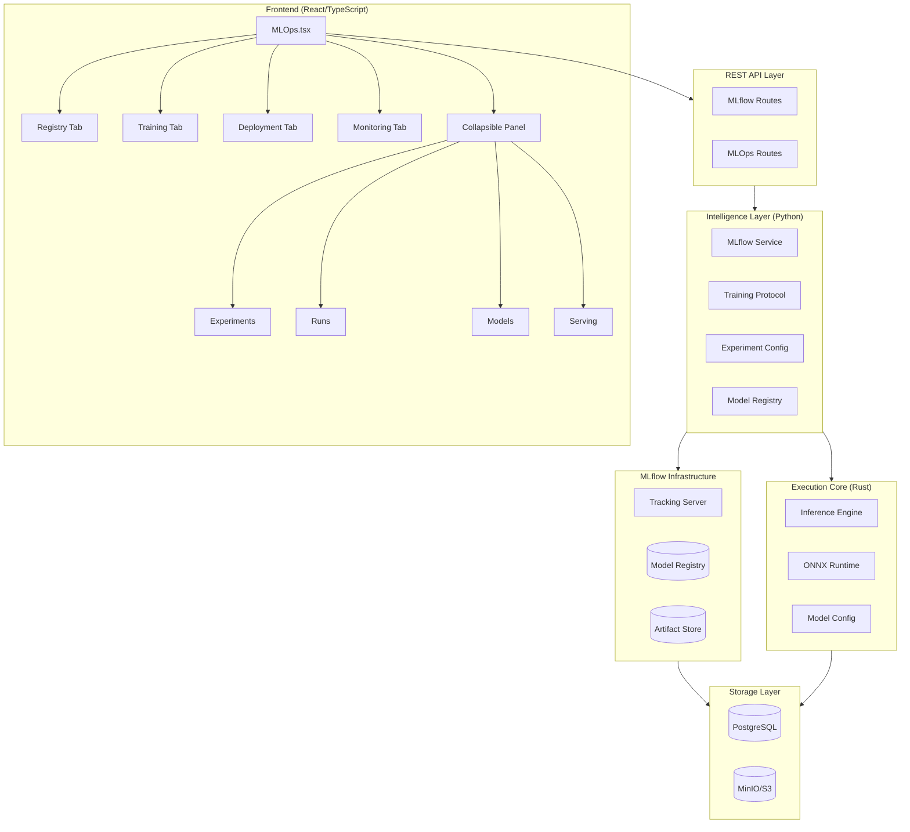
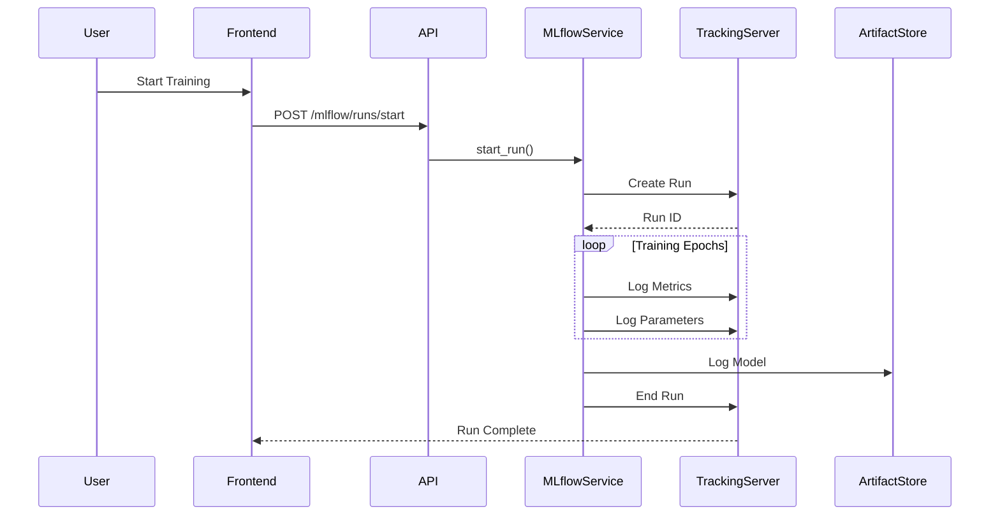
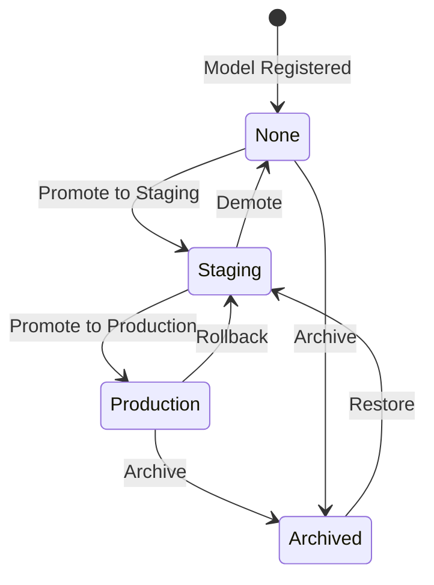
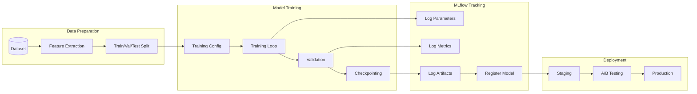
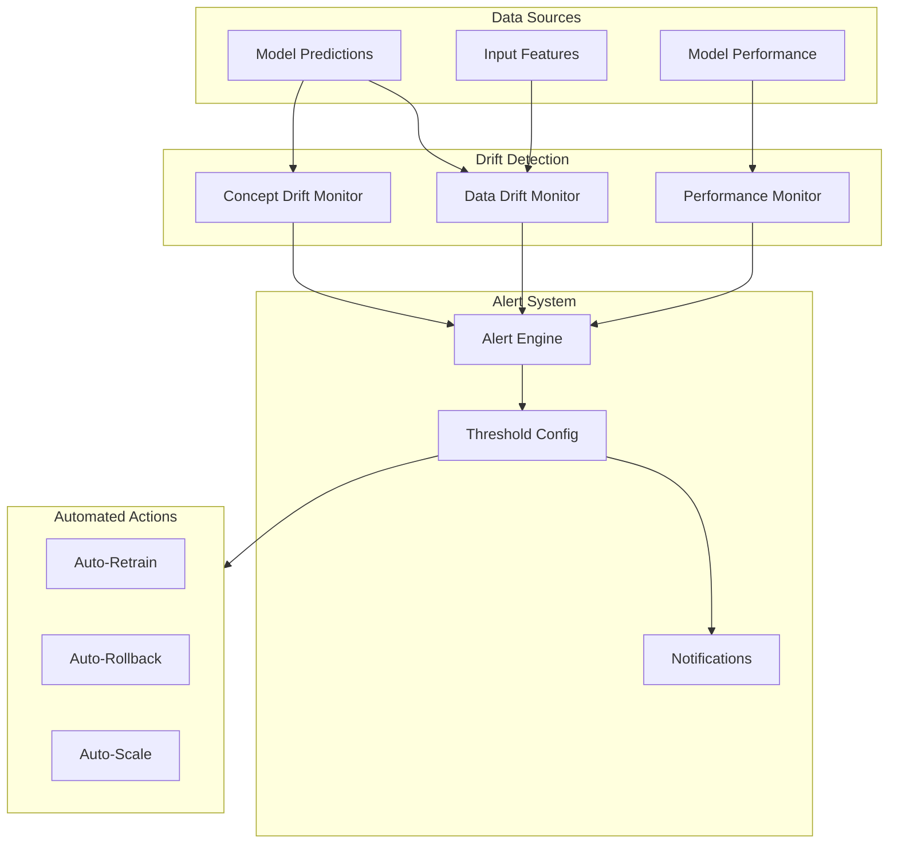

# MLOps Architecture

This document describes the MLOps architecture for the algorithmic trading system, including MLflow integration, model lifecycle management, and deployment workflows.

## System Overview



## MLflow Integration Flow



## Model Lifecycle State Machine



## Training Pipeline



## Component Architecture

### Frontend Components

```
MLOps.tsx
+-- Header (MLOPS - MACHINE LEARNING OPERATIONS)
+-- Tab Navigation
|   +-- Registry Tab
|   +-- Training Tab
|   +-- Deployment Tab
|   +-- Monitoring Tab
+-- Collapsible Subcategory Panel (left)
|   +-- MLflow Status Indicator
|   +-- Experiments Browser
|   +-- Runs List (with multi-select)
|   +-- Registered Models
|   +-- Serving Endpoints
+-- Main Content Area (right)
    +-- Run Comparison Chart
    +-- Tab-specific content
    +-- Modals (Dataset, Training, Deploy)
```

### Backend Services

```
intelligence_layer/
+-- mlflow_service.py
|   +-- MLflowService (main service)
|   +-- MLflowConfig (configuration)
|   +-- ExperimentInfo, RunInfo (data classes)
|   +-- ModelStage, RunStatus (enums)
+-- mlflow_routes.py
|   +-- /experiments endpoints
|   +-- /runs endpoints
|   +-- /models endpoints
|   +-- /serving endpoints
+-- training_protocol.py
|   +-- EmbeddingTrainer (with MLflow logging)
|   +-- TrainingConfig
|   +-- ModelVersion
```

### Rust Inference Engine

```
execution_core/
+-- ml_inference.rs
|   +-- InferenceEngine (ONNX model manager)
|   +-- ModelsConfig (TOML configuration)
|   +-- CachedModel (model wrapper)
|   +-- RegimeDetector (helper)
+-- config/
    +-- models.toml (model configurations)
```

## Data Flow

### Experiment Tracking

```
+-------------+    +-------------+    +-------------+
|   Python    |    |   MLflow    |    | PostgreSQL  |
|   Client    |--->|   Server    |--->|  Database   |
+-------------+    +-------------+    +-------------+
      |                  |
      |                  v
      |           +-------------+
      +---------->|   MinIO     |
                  | (Artifacts) |
                  +-------------+
```

### Model Serving

```
+-------------+    +-------------+    +-------------+
|   Request   |    | Intelligence|    |  Execution  |
|   (REST)    |--->|    Layer    |--->|    Core     |
+-------------+    +-------------+    +-------------+
                         |                  |
                         v                  v
                  +-------------+    +-------------+
                  |   MLflow    |    |    ONNX     |
                  |   Models    |    |   Runtime   |
                  +-------------+    +-------------+
```

## Infrastructure

### Docker Services

| Service | Image | Ports | Purpose |
|---------|-------|-------|---------|
| mlflow-server | ghcr.io/mlflow/mlflow:v2.10.0 | 5000 | Tracking & Registry |
| mlflow-db | postgres:15-alpine | 5433 | Metadata Storage |
| mlflow-minio | minio/minio:latest | 9000, 9001 | Artifact Storage |
| mlflow-minio-init | minio/mc:latest | - | Bucket Creation |

### Network Architecture

```
+--------------------------------------------------+
|                  mlflow-network                   |
|                                                  |
|  +------------+  +------------+  +------------+  |
|  |  mlflow-   |  |  mlflow-   |  |  mlflow-   |  |
|  |  server    |  |  db        |  |  minio     |  |
|  |  :5000     |  |  :5432     |  |  :9000     |  |
|  +------------+  +------------+  +------------+  |
|                                                  |
+--------------------------------------------------+
         |              |              |
         v              v              v
    External       Internal       External
    (UI, API)      (Docker)      (Console)
```

## Monitoring Architecture



## Security Architecture

```
+--------------------------------------------------+
|                  Security Layers                  |
+--------------------------------------------------+
|                                                  |
|  +------------------+  +------------------+      |
|  | Authentication   |  | Authorization    |      |
|  | (MLflow Auth)    |  | (Role-based)     |      |
|  +------------------+  +------------------+      |
|                                                  |
|  +------------------+  +------------------+      |
|  | TLS/SSL          |  | Network          |      |
|  | (All Services)   |  | (Isolation)      |      |
|  +------------------+  +------------------+      |
|                                                  |
|  +------------------+  +------------------+      |
|  | Secrets Mgmt     |  | Audit Logging    |      |
|  | (Env/Vault)      |  | (All Actions)    |      |
|  +------------------+  +------------------+      |
|                                                  |
+--------------------------------------------------+
```

## Scaling Considerations

### Horizontal Scaling

- **MLflow Server**: Stateless, can be scaled behind load balancer
- **PostgreSQL**: Primary-replica setup for read scaling
- **MinIO**: Distributed mode for artifact storage scaling

### Vertical Scaling

- **Inference Engine**: GPU support for model inference
- **Training**: Multi-GPU training support
- **Batch Processing**: Distributed training with Ray/Horovod

---

**Last Updated**: February 2026
