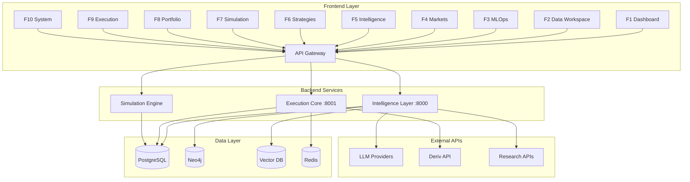

# End-to-End Integration Strategy

## Overview

This document outlines the comprehensive strategy for conducting end-to-end integration of all 10 modules (F1-F10) in the Algorithmic Trading System. The integration will transform the current mock-based frontend into a fully connected, real-time trading system.

## 🎯 Integration Objectives

### Primary Goals
1. **Full Backend Connectivity**: Connect all frontend modules to their respective backend services
2. **Real-time Data Flow**: Establish live data pipelines across all components
3. **Cross-Module Integration**: Ensure seamless data sharing between modules
4. **Production Readiness**: Achieve production-grade reliability and performance
5. **Comprehensive Testing**: Validate all integration points and workflows

### Success Criteria
- All 10 modules functional with live backend data
- Real-time updates propagating across the system
- Complete trading workflows operational
- Performance benchmarks met
- Zero critical integration bugs

## 📋 Integration Phases

### Phase 1: Foundation & Infrastructure (Week 1-2)
**Objective**: Establish core infrastructure and data layer connections

#### 1.1 Database Integration
- **PostgreSQL Setup**
  - Configure connection pools
  - Implement database migrations
  - Set up transaction management
  - Create indexes for performance

- **Neo4j Aura Integration**
  - Establish secure connections
  - Configure graph schemas
  - Set up GDS algorithms
  - Test query performance

- **Vector Database Setup**
  - Configure Chroma/Pinecone
  - Set up embedding pipelines
  - Test similarity search
  - Optimize vector operations

- **Redis Configuration**
  - Set up caching layers
  - Configure session management
  - Implement pub/sub for real-time updates

#### 1.2 Core Services Deployment
- **Intelligence Layer (Port 8000)**
  - Deploy FastAPI application
  - Configure LLM/RAG services
  - Set up research automation
  - Test AI endpoints

- **Execution Core (Port 8001)**
  - Deploy Rust services
  - Configure portfolio management
  - Set up risk management
  - Test order execution

#### 1.3 External API Integration
- **Deriv API Connection**
  - Configure authentication
  - Set up market data feeds
  - Test order placement
  - Implement error handling

- **LLM Provider Setup**
  - Configure OpenAI/Anthropic APIs
  - Set up rate limiting
  - Implement fallback mechanisms
  - Test response quality

### Phase 2: Module-by-Module Integration (Week 3-6)

#### 2.1 Dashboard (F1) - System Overview
**Priority**: High (Foundation for monitoring)

**Integration Tasks**:
- Connect to health check endpoints
- Implement real-time system metrics
- Set up alert notifications
- Configure performance monitoring

**API Endpoints**:
```
GET /health/system
GET /metrics/performance
GET /alerts/active
POST /system/emergency-stop
```

**Testing**:
- System health monitoring accuracy
- Real-time metric updates
- Emergency controls functionality

#### 2.2 Data Workspace (F2) - Analytics Platform
**Priority**: High (Data foundation)

**Integration Tasks**:
- Connect to data import services
- Implement real-time visualization
- Set up data transformation pipelines
- Configure export functionality

**API Endpoints**:
```
POST /data/import
GET /data/visualizations
POST /data/transform
GET /data/export/{format}
```

**Testing**:
- Large file upload handling
- Real-time chart updates
- Data transformation accuracy
- Export functionality

#### 2.3 MLOps (F3) - Model Management
**Priority**: High (AI/ML foundation)

**Integration Tasks**:
- Connect to model registry
- Implement training job management
- Set up model deployment pipelines
- Configure performance monitoring

**API Endpoints**:
```
GET /models/registry
POST /models/train
POST /models/deploy
GET /models/metrics
```

**Testing**:
- Model training workflows
- Deployment automation
- Performance monitoring
- Version control

#### 2.4 Markets (F4) - Live Market Data
**Priority**: Critical (Real-time data source)

**Integration Tasks**:
- Connect to Deriv API
- Implement WebSocket connections
- Set up market data processing
- Configure correlation analysis

**API Endpoints**:
```
GET /markets/live-data
WS /markets/stream
GET /markets/correlations
POST /markets/alerts
```

**Testing**:
- Real-time data accuracy
- WebSocket stability
- Correlation calculations
- Alert system functionality

#### 2.5 Intelligence (F5) - AI-Powered Analysis
**Priority**: Critical (Core AI functionality)

**Integration Tasks**:
- Connect LLM/RAG services
- Implement research automation
- Set up document processing
- Configure analysis models

**API Endpoints**:
```
POST /llm/query
POST /rag/query
POST /research/comprehensive
POST /documents/ingest
GET /models/analysis
```

**Testing**:
- LLM response quality
- RAG accuracy
- Research automation
- Document processing
- Model management

#### 2.6 Strategies (F6) - Algorithm Development
**Priority**: High (Trading logic)

**Integration Tasks**:
- Connect to strategy registry
- Implement backtesting integration
- Set up performance tracking
- Configure strategy deployment

**API Endpoints**:
```
GET /strategies/registry
POST /strategies/create
POST /strategies/backtest
POST /strategies/deploy
```

**Testing**:
- Strategy creation workflows
- Backtesting accuracy
- Performance calculations
- Deployment processes

#### 2.7 Simulation (F7) - Advanced Backtesting
**Priority**: High (Risk validation)

**Integration Tasks**:
- Connect to simulation engine
- Implement Monte Carlo analysis
- Set up stress testing
- Configure scenario analysis

**API Endpoints**:
```
POST /simulation/backtest
POST /simulation/monte-carlo
POST /simulation/stress-test
GET /simulation/results
```

**Testing**:
- Backtesting accuracy
- Monte Carlo reliability
- Stress test scenarios
- Result analysis

#### 2.8 Portfolio (F8) - Risk Management
**Priority**: Critical (Risk control)

**Integration Tasks**:
- Connect to portfolio manager
- Implement real-time risk metrics
- Set up position tracking
- Configure risk limits

**API Endpoints**:
```
GET /portfolio/positions
GET /portfolio/risk-metrics
POST /portfolio/rebalance
POST /portfolio/risk-limits
```

**Testing**:
- Real-time position updates
- Risk metric accuracy
- Rebalancing logic
- Risk limit enforcement

#### 2.9 Execution (F9) - Order Management
**Priority**: Critical (Trading execution)

**Integration Tasks**:
- Connect to order management system
- Implement execution algorithms
- Set up trade reporting
- Configure risk controls

**API Endpoints**:
```
POST /orders/create
GET /orders/status
GET /executions/history
POST /executions/cancel
```

**Testing**:
- Order placement accuracy
- Execution quality
- Trade reporting
- Risk controls

#### 2.10 System (F10) - Infrastructure Management
**Priority**: Medium (Operations)

**Integration Tasks**:
- Connect to system monitoring
- Implement configuration management
- Set up logging aggregation
- Configure maintenance tools

**API Endpoints**:
```
GET /system/status
POST /system/config
GET /system/logs
POST /system/maintenance
```

**Testing**:
- System monitoring accuracy
- Configuration management
- Log aggregation
- Maintenance procedures

### Phase 3: Cross-Module Integration (Week 7-8)

#### 3.1 Data Flow Integration
**Objective**: Ensure seamless data flow between modules

**Integration Workflows**:
1. **Market Data → Intelligence → Strategies**
   - Live market data feeds intelligence analysis
   - Intelligence signals trigger strategy adjustments
   - Strategy performance feeds back to intelligence

2. **Strategies → Simulation → Portfolio → Execution**
   - Strategies tested in simulation
   - Validated strategies deployed to portfolio
   - Portfolio generates execution orders

3. **Data Workspace → MLOps → Intelligence**
   - Data workspace provides training data
   - MLOps manages model lifecycle
   - Intelligence uses deployed models

#### 3.2 Real-time Event System
**Implementation**:
- WebSocket connections for live updates
- Event bus for cross-module communication
- State synchronization across components
- Conflict resolution mechanisms

#### 3.3 State Management Integration
**Components**:
- Centralized state store (Redux/Zustand)
- Real-time state synchronization
- Optimistic updates with rollback
- Conflict resolution strategies

### Phase 4: Performance Optimization (Week 9)

#### 4.1 Performance Benchmarks
**Targets**:
- API response time: < 100ms (95th percentile)
- WebSocket latency: < 50ms
- Database query time: < 10ms
- UI update frequency: 60fps
- Memory usage: < 2GB per service

#### 4.2 Optimization Strategies
- Database query optimization
- Caching layer implementation
- Connection pooling
- Load balancing
- CDN integration

### Phase 5: Testing & Validation (Week 10)

#### 5.1 Integration Testing
**Test Categories**:
- Unit tests for individual components
- Integration tests for API endpoints
- End-to-end workflow tests
- Performance and load tests
- Security and penetration tests

#### 5.2 User Acceptance Testing
**Test Scenarios**:
- Complete trading workflows
- Risk management scenarios
- Emergency procedures
- Data analysis workflows
- System recovery procedures

## 🔧 Technical Implementation Details

### API Integration Architecture



### Service Communication Patterns

#### 1. Request-Response (HTTP/REST)
```typescript
// Frontend service calls
const response = await api.post('/intelligence/llm/query', {
  query: 'Analyze EURUSD volatility',
  system_prompt: 'You are a financial analyst'
});
```

#### 2. Real-time Updates (WebSocket)
```typescript
// WebSocket connection for live data
const ws = new WebSocket('ws://localhost:8000/ws/markets');
ws.onmessage = (event) => {
  const marketData = JSON.parse(event.data);
  updateMarketDisplay(marketData);
};
```

#### 3. Event-Driven Communication (Event Bus)
```typescript
// Cross-module event communication
eventBus.emit('portfolio.position.updated', {
  symbol: 'EURUSD',
  quantity: 10000,
  pnl: 150.50
});
```

### Error Handling Strategy

#### 1. Circuit Breaker Pattern
```typescript
class CircuitBreaker {
  private failures = 0;
  private lastFailTime = 0;
  private state: 'CLOSED' | 'OPEN' | 'HALF_OPEN' = 'CLOSED';

  async call<T>(fn: () => Promise<T>): Promise<T> {
    if (this.state === 'OPEN') {
      if (Date.now() - this.lastFailTime > this.timeout) {
        this.state = 'HALF_OPEN';
      } else {
        throw new Error('Circuit breaker is OPEN');
      }
    }

    try {
      const result = await fn();
      this.onSuccess();
      return result;
    } catch (error) {
      this.onFailure();
      throw error;
    }
  }
}
```

#### 2. Retry with Exponential Backoff
```typescript
async function retryWithBackoff<T>(
  fn: () => Promise<T>,
  maxRetries = 3,
  baseDelay = 1000
): Promise<T> {
  for (let attempt = 0; attempt <= maxRetries; attempt++) {
    try {
      return await fn();
    } catch (error) {
      if (attempt === maxRetries) throw error;
      
      const delay = baseDelay * Math.pow(2, attempt);
      await new Promise(resolve => setTimeout(resolve, delay));
    }
  }
  throw new Error('Max retries exceeded');
}
```

### Data Synchronization Strategy

#### 1. Optimistic Updates
```typescript
// Update UI immediately, rollback on failure
const optimisticUpdate = async (action: Action) => {
  // Apply update to UI
  dispatch(action);
  
  try {
    // Send to backend
    await api.post('/update', action.payload);
  } catch (error) {
    // Rollback on failure
    dispatch(rollbackAction(action));
    throw error;
  }
};
```

#### 2. Event Sourcing
```typescript
// Track all state changes as events
interface Event {
  id: string;
  type: string;
  payload: any;
  timestamp: number;
  userId: string;
}

class EventStore {
  async append(event: Event): Promise<void> {
    await this.db.events.insert(event);
    this.eventBus.emit(event.type, event);
  }

  async replay(fromTimestamp: number): Promise<Event[]> {
    return this.db.events.find({
      timestamp: { $gte: fromTimestamp }
    });
  }
}
```

## 📊 Integration Monitoring & Metrics

### Key Performance Indicators (KPIs)

#### 1. System Performance
- **API Response Time**: < 100ms (95th percentile)
- **Database Query Time**: < 10ms average
- **WebSocket Latency**: < 50ms
- **Memory Usage**: < 2GB per service
- **CPU Usage**: < 70% average

#### 2. Business Metrics
- **Order Execution Time**: < 500ms
- **Risk Calculation Accuracy**: 99.9%
- **Data Freshness**: < 1 second lag
- **System Uptime**: 99.9%
- **Error Rate**: < 0.1%

#### 3. User Experience
- **Page Load Time**: < 2 seconds
- **UI Response Time**: < 100ms
- **Data Visualization Refresh**: < 500ms
- **Module Switch Time**: < 200ms

### Monitoring Tools

#### 1. Application Monitoring
```typescript
// Custom metrics collection
class MetricsCollector {
  private metrics: Map<string, number[]> = new Map();

  recordLatency(operation: string, duration: number) {
    if (!this.metrics.has(operation)) {
      this.metrics.set(operation, []);
    }
    this.metrics.get(operation)!.push(duration);
  }

  getP95(operation: string): number {
    const values = this.metrics.get(operation) || [];
    const sorted = values.sort((a, b) => a - b);
    const index = Math.ceil(sorted.length * 0.95) - 1;
    return sorted[index] || 0;
  }
}
```

#### 2. Health Checks
```typescript
// Comprehensive health check system
interface HealthCheck {
  name: string;
  status: 'healthy' | 'degraded' | 'unhealthy';
  latency: number;
  details?: any;
}

class HealthMonitor {
  async checkSystem(): Promise<HealthCheck[]> {
    return Promise.all([
      this.checkDatabase(),
      this.checkExternalAPIs(),
      this.checkServices(),
      this.checkMemory(),
      this.checkDisk()
    ]);
  }

  private async checkDatabase(): Promise<HealthCheck> {
    const start = Date.now();
    try {
      await this.db.query('SELECT 1');
      return {
        name: 'database',
        status: 'healthy',
        latency: Date.now() - start
      };
    } catch (error) {
      return {
        name: 'database',
        status: 'unhealthy',
        latency: Date.now() - start,
        details: error.message
      };
    }
  }
}
```

## 🚨 Risk Management & Contingency Plans

### Integration Risks

#### 1. Data Consistency Issues
**Risk**: Data synchronization failures between modules
**Mitigation**: 
- Implement event sourcing
- Use distributed transactions where necessary
- Create data validation checkpoints
- Implement rollback mechanisms

#### 2. Performance Degradation
**Risk**: System slowdown under load
**Mitigation**:
- Implement caching strategies
- Use connection pooling
- Set up load balancing
- Create performance monitoring alerts

#### 3. External API Failures
**Risk**: Third-party service outages
**Mitigation**:
- Implement circuit breakers
- Create fallback mechanisms
- Use multiple providers where possible
- Cache critical data locally

#### 4. Security Vulnerabilities
**Risk**: Data breaches or unauthorized access
**Mitigation**:
- Implement proper authentication
- Use encrypted connections
- Regular security audits
- Input validation and sanitization

### Rollback Strategy

#### 1. Database Rollback
```sql
-- Transaction-based rollback
BEGIN TRANSACTION;
-- Integration changes
SAVEPOINT integration_checkpoint;
-- If issues occur
ROLLBACK TO integration_checkpoint;
COMMIT;
```

#### 2. Service Rollback
```bash
# Blue-green deployment rollback
kubectl set image deployment/intelligence-layer \
  intelligence-layer=intelligence-layer:previous-version

# Verify rollback
kubectl rollout status deployment/intelligence-layer
```

#### 3. Configuration Rollback
```typescript
// Configuration version control
class ConfigManager {
  private versions: Map<string, any> = new Map();

  async rollback(service: string, version: string) {
    const config = this.versions.get(`${service}:${version}`);
    if (config) {
      await this.applyConfig(service, config);
    }
  }
}
```

## 📅 Implementation Timeline

### Week 1-2: Foundation
- [ ] Database setup and configuration
- [ ] Core service deployment
- [ ] External API integration
- [ ] Basic health checks

### Week 3-4: Core Modules
- [ ] Dashboard (F1) integration
- [ ] Markets (F4) real-time data
- [ ] Intelligence (F5) AI services
- [ ] Portfolio (F8) risk management

### Week 5-6: Secondary Modules
- [ ] Data Workspace (F2) analytics
- [ ] MLOps (F3) model management
- [ ] Strategies (F6) algorithm development
- [ ] Execution (F9) order management

### Week 7-8: Integration & Optimization
- [ ] Cross-module data flow
- [ ] Real-time event system
- [ ] Performance optimization
- [ ] Security hardening

### Week 9-10: Testing & Validation
- [ ] Integration testing
- [ ] Performance testing
- [ ] User acceptance testing
- [ ] Production deployment

## 🎯 Success Metrics

### Technical Metrics
- [ ] All 10 modules connected to backend services
- [ ] Real-time data flowing across all components
- [ ] Performance benchmarks met
- [ ] Zero critical integration bugs
- [ ] 99.9% system uptime

### Business Metrics
- [ ] Complete trading workflows operational
- [ ] Risk management systems active
- [ ] AI/ML services providing insights
- [ ] Real-time market analysis functional
- [ ] Order execution system operational

### User Experience Metrics
- [ ] Seamless navigation between modules
- [ ] Real-time updates across all interfaces
- [ ] Responsive UI performance
- [ ] Comprehensive error handling
- [ ] Professional trading experience

## 📞 Support & Escalation

### Integration Team Structure
- **Technical Lead**: Overall integration strategy
- **Backend Engineers**: Service integration
- **Frontend Engineers**: UI/UX integration
- **DevOps Engineers**: Infrastructure and deployment
- **QA Engineers**: Testing and validation

### Escalation Path
1. **Level 1**: Development team resolution
2. **Level 2**: Technical lead involvement
3. **Level 3**: Architecture review and redesign
4. **Level 4**: External consultant engagement

---

**Document Version**: 1.0  
**Last Updated**: January 2025  
**Status**: Ready for Implementation  
**Estimated Duration**: 10 weeks  
**Team Size**: 5-7 engineers