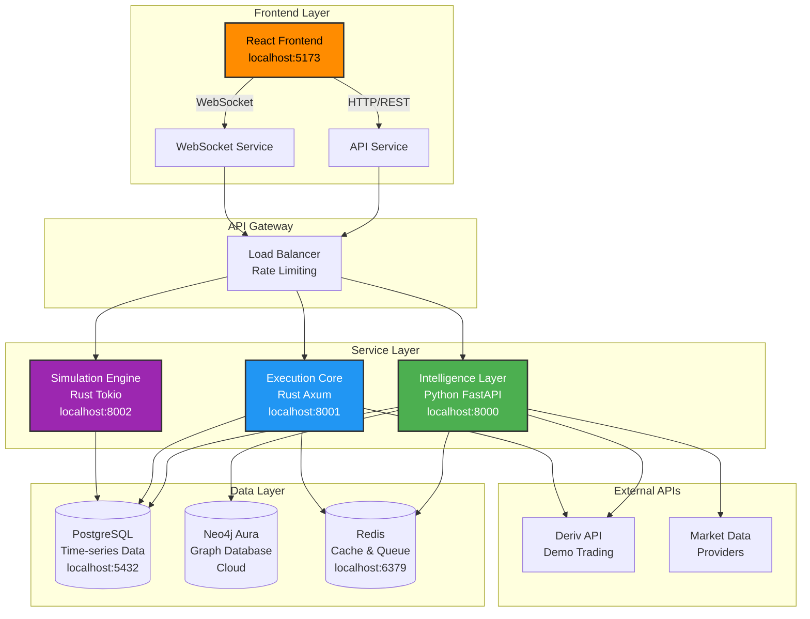
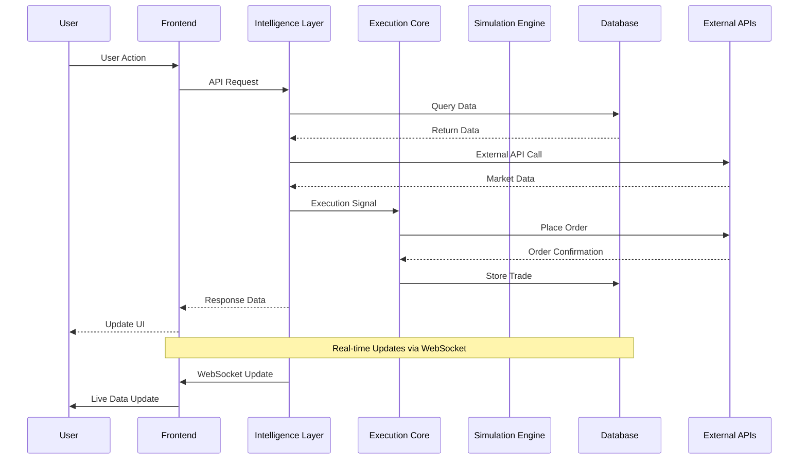
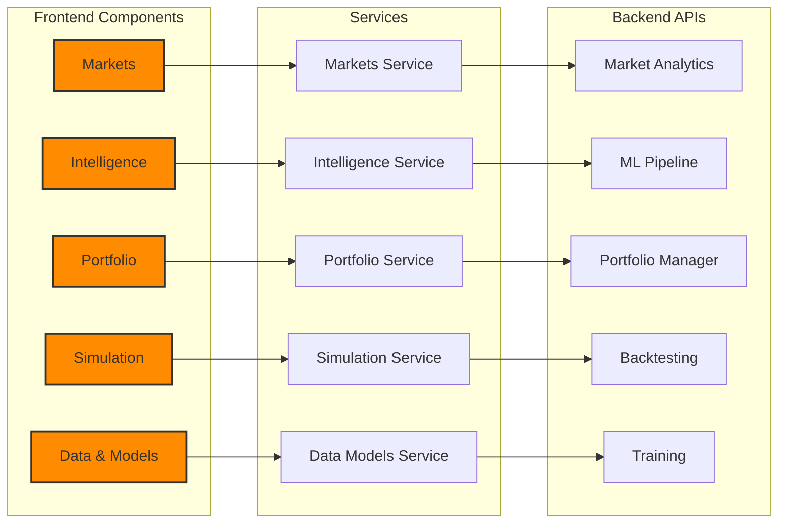
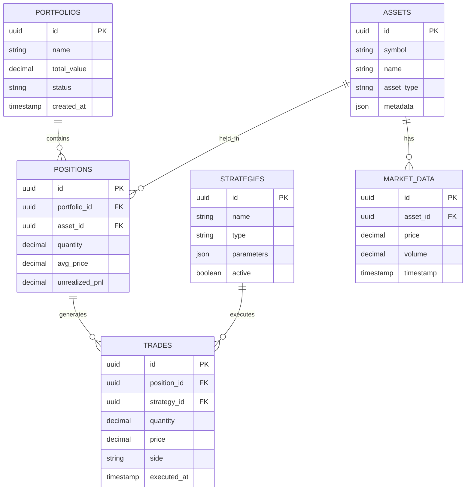
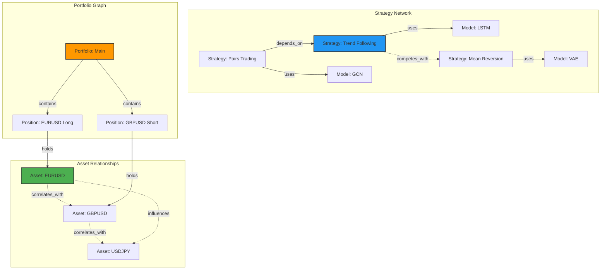
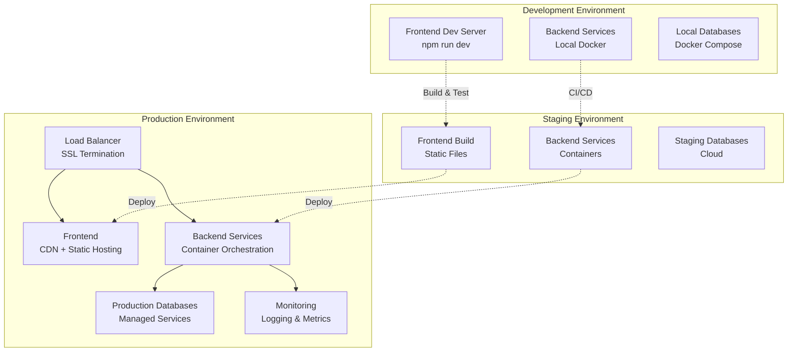
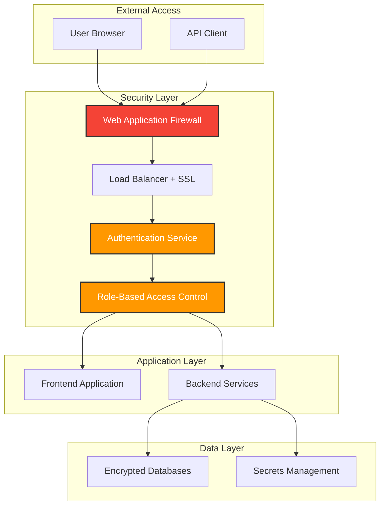
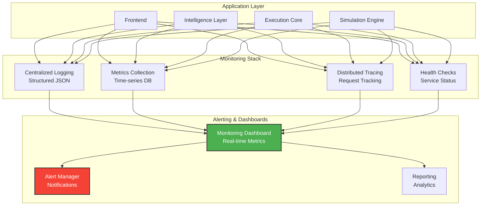

# System Architecture Diagrams

## High-Level System Architecture

## Data Flow Architecture

## Component Interaction Diagram

## Database Schema Overview

## Neo4j Graph Schema

## Deployment Architecture

## Security Architecture

## Monitoring & Observability

---

**Note**: These diagrams use Mermaid syntax and can be rendered in most modern markdown viewers, including GitHub, GitLab, and documentation platforms that support Mermaid.