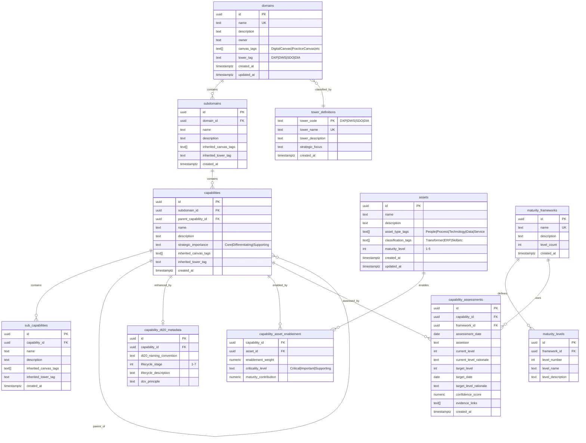
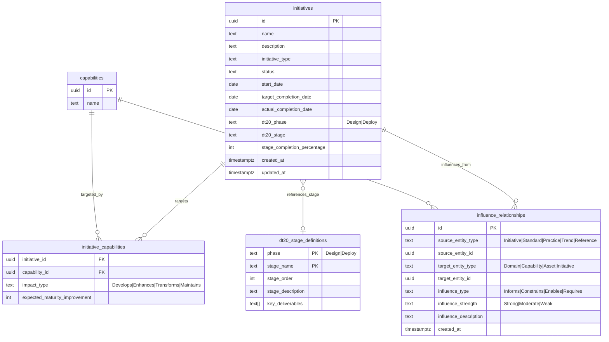

# DT2.0 Metamodel Schema
## Enterprise-Grade Digital Transformation Framework

---

# OVERVIEW

This document defines the **DT2.0 Digital Transformation Metamodel** aligned with TOGAF/ArchiMate, SAFe, and portfolio governance practices. The metamodel is conceptually clean, treating canvases as views/lenses rather than structural entities, and maintaining clear separation between enterprise primitives and analytical constructs.

**Core Principle**: Domains and Capabilities are stable enterprise primitives. Canvases, Towers, and Phases are classification mechanisms, not ownership hierarchies.

---

# 1. CORE ARCHITECTURAL PRINCIPLES

## 1.1 Foundational Rules

1. **Domains & Capabilities are stable enterprise primitives** - They represent the fundamental structure of the organization
2. **Canvases are views, not containers** - The same domain appears in multiple canvases through tagging
3. **Tags classify; structure defines ownership** - Classification is orthogonal to hierarchy
4. **Layers classify; models decompose** - Layers (Direct/Control/Execute) are classifications; Operating Models decompose
5. **Assets are generic; meaning comes from tags** - Single Asset entity with type tags
6. **Delta is analytical, not ontological** - Gaps are derived from assessments, not stored as entities
7. **Phases explain; they do not govern data** - Design/Deploy phases are methodological, not structural

## 1.2 Canvas Semantics

**What is a Canvas?**
- A lens or grouping mechanism for viewing enterprise objects
- NOT a structural entity or container
- The same Domain/Capability appears in multiple canvases simultaneously

**Canvas Types:**
- **Digital Canvas**: Groups domains by digital transformation streams
- **Practice Canvas**: Groups domains by operational responsibility
- **Initiative Canvas**: Groups initiatives by transformation phase
- **Capability Canvas**: Groups capabilities by strategic importance

**Implementation:**
- Canvases are represented through tags applied at the Domain level
- Tags are inherited downward through SubDomains → Capabilities → SubCapabilities

---

# 2. DOMAIN MODEL

## 2.1 Core Domain Structure

```sql
-- Core enterprise domain (unchanged from base schema)
CREATE TABLE domains (
  id UUID PRIMARY KEY DEFAULT gen_random_uuid(),
  name TEXT NOT NULL UNIQUE,
  description TEXT,
  owner TEXT,
  
  -- Canvas classification tags (inherited downward)
  canvas_tags TEXT[] DEFAULT ARRAY[]::TEXT[], -- e.g., ['DigitalCanvas', 'PracticeCanvas']
  
  -- Tower classification (fixed mapping)
  tower_tag TEXT CHECK (tower_tag IN ('DXP', 'DWS', 'SDO', 'DIA')),
  
  created_at TIMESTAMPTZ DEFAULT now(),
  updated_at TIMESTAMPTZ DEFAULT now()
);

-- Subdomain hierarchy (inherits tags from parent domain)
CREATE TABLE subdomains (
  id UUID PRIMARY KEY DEFAULT gen_random_uuid(),
  domain_id UUID NOT NULL REFERENCES domains(id) ON DELETE CASCADE,
  name TEXT NOT NULL,
  description TEXT,
  
  -- Tags inherited from parent domain (computed/denormalized)
  inherited_canvas_tags TEXT[],
  inherited_tower_tag TEXT,
  
  created_at TIMESTAMPTZ DEFAULT now(),
  UNIQUE(domain_id, name)
);
```

## 2.2 Domain Tag Semantics

**Canvas Tags** (applied at Domain level):
- `DigitalCanvas` - Domain appears in Digital Canvas view
- `PracticeCanvas` - Domain appears in Practice Canvas view  
- `InitiativeCanvas` - Domain appears in Initiative Canvas view
- `CapabilityCanvas` - Domain appears in Capability Canvas view

**Tower Tags** (fixed classification):
- `DXP` - Digital Experience Platform
- `DWS` - Digital Workspace
- `SDO` - Service Delivery Operations
- `DIA` - Digital Intelligence & Analytics

**Tag Inheritance:**
```
Domain [canvas_tags, tower_tag]
  └── SubDomain [inherits tags]
      └── Capability [inherits tags]
          └── SubCapability [inherits tags]
```

---

# 3. CAPABILITY MODEL

## 3.1 Core Capability Structure

```sql
-- Enterprise capabilities (unchanged from base schema)
CREATE TABLE capabilities (
  id UUID PRIMARY KEY DEFAULT gen_random_uuid(),
  subdomain_id UUID REFERENCES subdomains(id) ON DELETE CASCADE,
  parent_capability_id UUID REFERENCES capabilities(id),
  name TEXT NOT NULL,
  description TEXT,
  strategic_importance TEXT CHECK (strategic_importance IN ('Core', 'Differentiating', 'Supporting')),
  
  -- Inherited classification tags (denormalized for query performance)
  inherited_canvas_tags TEXT[],
  inherited_tower_tag TEXT,
  
  created_at TIMESTAMPTZ DEFAULT now()
);

-- Sub-capabilities (inherits all tags from parent capability)
CREATE TABLE sub_capabilities (
  id UUID PRIMARY KEY DEFAULT gen_random_uuid(),
  capability_id UUID NOT NULL REFERENCES capabilities(id) ON DELETE CASCADE,
  name TEXT NOT NULL,
  description TEXT,
  
  -- Inherited tags
  inherited_canvas_tags TEXT[],
  inherited_tower_tag TEXT,
  
  created_at TIMESTAMPTZ DEFAULT now(),
  UNIQUE(capability_id, name)
);
```

## 3.2 DT2.0 Capability Metadata

```sql
-- DT2.0-specific capability enhancements (metadata only, not structural)
CREATE TABLE capability_dt20_metadata (
  id UUID PRIMARY KEY DEFAULT gen_random_uuid(),
  capability_id UUID NOT NULL REFERENCES capabilities(id) ON DELETE CASCADE,
  
  -- DT2.0 naming convention: "Manage" + 2-3 descriptive words
  dt20_naming_convention TEXT,
  
  -- Lifecycle stage (1-7)
  lifecycle_stage INT CHECK (lifecycle_stage BETWEEN 1 AND 7),
  lifecycle_description TEXT,
  
  -- Dynamic Capability Value principle
  dcv_principle TEXT,
  
  UNIQUE(capability_id)
);
```

---

# 4. ASSET MODEL (SIMPLIFIED)

## 4.1 Unified Asset Entity

```sql
-- Single Asset entity with type tags (no subclasses)
CREATE TABLE assets (
  id UUID PRIMARY KEY DEFAULT gen_random_uuid(),
  name TEXT NOT NULL,
  description TEXT,
  
  -- Asset type tags (multiple tags allowed)
  asset_type_tags TEXT[] NOT NULL DEFAULT ARRAY[]::TEXT[],
  -- Examples: ['People'], ['Technology', 'ERP'], ['Process', 'Transformer']
  
  -- Asset classification tags (for additional semantics)
  classification_tags TEXT[] DEFAULT ARRAY[]::TEXT[],
  -- Examples: ['Skill'], ['ControlSystem'], ['DataPlatform']
  
  maturity_level INT CHECK (maturity_level BETWEEN 1 AND 5),
  
  created_at TIMESTAMPTZ DEFAULT now(),
  updated_at TIMESTAMPTZ DEFAULT now()
);

-- Asset enablement of capabilities (DCV principle)
CREATE TABLE capability_asset_enablement (
  capability_id UUID NOT NULL REFERENCES capabilities(id) ON DELETE CASCADE,
  asset_id UUID NOT NULL REFERENCES assets(id) ON DELETE CASCADE,
  
  enablement_weight NUMERIC(3,2) DEFAULT 0.20 CHECK (enablement_weight BETWEEN 0 AND 1),
  criticality_level TEXT CHECK (criticality_level IN ('Critical', 'Important', 'Supporting')),
  maturity_contribution NUMERIC(3,2), -- How much this asset contributes to capability maturity
  
  PRIMARY KEY (capability_id, asset_id)
);
```

**Asset Type Tags** (standard vocabulary):
- `People` - Human resources, skills, competencies
- `Process` - Business processes, workflows
- `Technology` - Systems, platforms, tools
- `Data` - Data assets, information resources
- `Service` - Services, APIs, integrations

**Classification Tags** (extensible):
- `Transformer` - Transformational asset
- `ERP` - Enterprise Resource Planning system
- `Skill` - Specific skill or competency
- `ControlSystem` - Control or governance system
- `DataPlatform` - Data platform or warehouse

---

# 5. MATURITY & ASSESSMENT MODEL

## 5.1 Maturity Framework

```sql
-- Maturity frameworks define levels (e.g., L1-L5)
CREATE TABLE maturity_frameworks (
  id UUID PRIMARY KEY DEFAULT gen_random_uuid(),
  name TEXT NOT NULL UNIQUE,
  description TEXT,
  level_count INT NOT NULL DEFAULT 5,
  created_at TIMESTAMPTZ DEFAULT now()
);

-- Framework levels (e.g., L1: Initial, L2: Managed, etc.)
CREATE TABLE maturity_levels (
  id UUID PRIMARY KEY DEFAULT gen_random_uuid(),
  framework_id UUID NOT NULL REFERENCES maturity_frameworks(id) ON DELETE CASCADE,
  level_number INT NOT NULL,
  level_name TEXT NOT NULL,
  level_description TEXT,
  
  UNIQUE(framework_id, level_number),
  UNIQUE(framework_id, level_name)
);
```

## 5.2 Capability Assessment (Time-Based Snapshots)

```sql
-- Capability assessments are time-based snapshots
CREATE TABLE capability_assessments (
  id UUID PRIMARY KEY DEFAULT gen_random_uuid(),
  capability_id UUID NOT NULL REFERENCES capabilities(id) ON DELETE CASCADE,
  framework_id UUID NOT NULL REFERENCES maturity_frameworks(id),
  
  assessment_date DATE NOT NULL DEFAULT CURRENT_DATE,
  assessor TEXT,
  
  -- Current state
  current_level INT NOT NULL,
  current_level_rationale TEXT,
  
  -- Target state
  target_level INT NOT NULL,
  target_date DATE,
  target_level_rationale TEXT,
  
  -- Assessment metadata
  confidence_score NUMERIC(3,2) CHECK (confidence_score BETWEEN 0 AND 1),
  evidence_links TEXT[],
  
  created_at TIMESTAMPTZ DEFAULT now(),
  
  UNIQUE(capability_id, framework_id, assessment_date)
);
```

## 5.3 Delta (Gap) - Derived, Not Stored

**Critical Rule**: Delta is **derived** from assessments, not stored as a structural entity.

**Analytical View** (computed on-demand):
```sql
-- Delta view (computed, not materialized)
CREATE OR REPLACE VIEW capability_gaps AS
SELECT 
  ca.id AS assessment_id,
  ca.capability_id,
  ca.framework_id,
  ca.assessment_date,
  ca.current_level,
  ca.target_level,
  (ca.target_level - ca.current_level) AS gap_size,
  CASE 
    WHEN ca.target_level > ca.current_level THEN 'Improvement Required'
    WHEN ca.target_level = ca.current_level THEN 'On Target'
    ELSE 'Over-Performing'
  END AS gap_status,
  ca.target_date,
  CASE 
    WHEN ca.target_date < CURRENT_DATE AND ca.current_level < ca.target_level 
    THEN 'Overdue'
    ELSE 'On Track'
  END AS timeline_status
FROM capability_assessments ca;
```

**Materialized View** (optional, for performance):
```sql
-- Materialized view for analytics (refreshed periodically)
CREATE MATERIALIZED VIEW capability_gaps_materialized AS
SELECT * FROM capability_gaps;

-- Refresh trigger (on assessment changes)
CREATE OR REPLACE FUNCTION refresh_capability_gaps()
RETURNS TRIGGER AS $$
BEGIN
  REFRESH MATERIALIZED VIEW CONCURRENTLY capability_gaps_materialized;
  RETURN NULL;
END;
$$ LANGUAGE plpgsql;

CREATE TRIGGER refresh_gaps_on_assessment
AFTER INSERT OR UPDATE OR DELETE ON capability_assessments
FOR EACH STATEMENT EXECUTE FUNCTION refresh_capability_gaps();
```

---

# 6. PRACTICE CANVAS (NOT A STRUCTURAL OBJECT)

## 6.1 Practice Canvas Semantics

**What is Practice Canvas?**
- A **grouping lens** over the same Domains and Capabilities
- Optimized for operational responsibility
- NOT a parent entity or separate hierarchy

**Correct Practice Model:**
```
Domain (same enterprise domain)
  └── Practice (classification/grouping)
      └── Function Area (operational grouping)
          └── Function (operational unit)
```

**Critical Clarification:**
- Domains are the same enterprise domains used in Digital Canvas
- There is only ONE Domain object in the architecture
- Practice Canvas classifies and organizes; it does not redefine

## 6.2 Practice Classification

```sql
-- Practice classification (applied to domains)
CREATE TABLE domain_practice_classification (
  id UUID PRIMARY KEY DEFAULT gen_random_uuid(),
  domain_id UUID NOT NULL REFERENCES domains(id) ON DELETE CASCADE,
  
  -- Practice metadata (not a separate entity)
  practice_name TEXT NOT NULL,
  practice_description TEXT,
  
  -- Layer classification (Direct / Control / Execute)
  layer_classification TEXT CHECK (layer_classification IN ('Direct', 'Control', 'Execute')),
  
  -- Function area grouping
  function_area TEXT,
  function_area_description TEXT,
  
  created_at TIMESTAMPTZ DEFAULT now(),
  
  UNIQUE(domain_id, practice_name)
);

-- Functions within practice areas (operational units)
CREATE TABLE practice_functions (
  id UUID PRIMARY KEY DEFAULT gen_random_uuid(),
  practice_classification_id UUID NOT NULL REFERENCES domain_practice_classification(id) ON DELETE CASCADE,
  
  function_name TEXT NOT NULL,
  function_description TEXT,
  service_delivery_model TEXT,
  stakeholders TEXT[],
  
  -- Link to existing capabilities (same capabilities, different view)
  related_capability_id UUID REFERENCES capabilities(id),
  
  created_at TIMESTAMPTZ DEFAULT now()
);
```

---

# 7. LAYERS VS OPERATING MODELS

## 7.1 Layer Semantics (Classification, Not Components)

**Layers** (Direct / Control / Execute) are **classifications**, not components.

**Correct Relationship:**
```
Practice Canvas
  └── Layer (classification: Direct / Control / Execute)
      └── Operating Model (design artifact, exists within Direct layer)
```

**Critical Rules:**
- Layers define WHERE something sits, not WHAT it contains
- Layers do NOT decompose
- Operating Models DO decompose

## 7.2 Operating Model Structure

```sql
-- Operating Models exist within Direct layer
CREATE TABLE operating_models (
  id UUID PRIMARY KEY DEFAULT gen_random_uuid(),
  practice_classification_id UUID NOT NULL REFERENCES domain_practice_classification(id),
  
  model_name TEXT NOT NULL,
  model_description TEXT,
  
  -- Operating model approach
  value_creation_approach TEXT,
  value_management_approach TEXT,
  value_delivery_approach TEXT,
  
  -- Constraint: Operating Models only exist in Direct layer
  CONSTRAINT direct_layer_only CHECK (
    (SELECT layer_classification FROM domain_practice_classification 
     WHERE id = practice_classification_id) = 'Direct'
  ),
  
  created_at TIMESTAMPTZ DEFAULT now()
);
```

## 7.3 Operating Model Domains (NOT Capability Domains)

**Critical Distinction:**
- **Capability Domains** = Enterprise capability structure
- **Operating Model Domains** = Operating model components (Workforce, Workflow, Governance, Outcomes, Deployment)

**Operating Model Domains reference capabilities but remain conceptually distinct.**

```sql
-- Operating Model components (domains within the operating model)
CREATE TABLE operating_model_components (
  id UUID PRIMARY KEY DEFAULT gen_random_uuid(),
  operating_model_id UUID NOT NULL REFERENCES operating_models(id) ON DELETE CASCADE,
  
  -- Operating Model domain (NOT capability domain)
  component_name TEXT NOT NULL CHECK (component_name IN (
    'Workforce',
    'Workflow',
    'Governance',
    'Outcomes',
    'Deployment'
  )),
  
  component_description TEXT,
  maturity_score INT CHECK (maturity_score BETWEEN 1 AND 5),
  
  UNIQUE(operating_model_id, component_name)
);

-- Operating Model elements (sub-components)
CREATE TABLE operating_model_elements (
  id UUID PRIMARY KEY DEFAULT gen_random_uuid(),
  component_id UUID NOT NULL REFERENCES operating_model_components(id) ON DELETE CASCADE,
  
  element_name TEXT NOT NULL,
  element_description TEXT,
  implementation_status TEXT DEFAULT 'Not Started',
  
  -- Reference to capabilities (influence, not ownership)
  related_capability_id UUID REFERENCES capabilities(id),
  
  created_at TIMESTAMPTZ DEFAULT now()
);
```

---

# 8. TOWERS (UPDATED CLASSIFICATION)

## 8.1 Tower Semantics

**Towers** replace the obsolete "streams" concept.

**Tower Types:**
- `DXP` - Digital Experience Platform
- `DWS` - Digital Workspace
- `SDO` - Service Delivery Operations
- `DIA` - Digital Intelligence & Analytics

**Canonical Rules:**
- Towers are **classification tags**, not entities
- Domain-to-Tower mapping is **known and fixed**
- Towers are applied as tags at the Domain level and **inherited downward**

## 8.2 Tower Mapping (Fixed)

```sql
-- Tower mapping is fixed and known (reference data)
CREATE TABLE tower_definitions (
  tower_code TEXT PRIMARY KEY CHECK (tower_code IN ('DXP', 'DWS', 'SDO', 'DIA')),
  tower_name TEXT NOT NULL UNIQUE,
  tower_description TEXT,
  strategic_focus TEXT,
  
  created_at TIMESTAMPTZ DEFAULT now()
);

-- Seed tower definitions
INSERT INTO tower_definitions (tower_code, tower_name, tower_description, strategic_focus) VALUES
('DXP', 'Digital Experience Platform', 'Customer-facing digital capabilities', 'Customer Experience & Engagement'),
('DWS', 'Digital Workspace', 'Employee-facing digital capabilities', 'Employee Experience & Productivity'),
('SDO', 'Service Delivery Operations', 'Core business and operational capabilities', 'Business Process Excellence'),
('DIA', 'Digital Intelligence & Analytics', 'Data, analytics, and intelligence capabilities', 'Insights & Decision Support');

-- Domain-to-Tower mapping (applied via tower_tag on domains table)
-- No separate mapping table needed; tower_tag is directly on domains
```

---

# 9. INITIATIVES & INFLUENCE

## 9.1 Initiative Structure

```sql
-- Initiatives (unchanged from base schema)
CREATE TABLE initiatives (
  id UUID PRIMARY KEY DEFAULT gen_random_uuid(),
  name TEXT NOT NULL,
  description TEXT,
  initiative_type TEXT,
  status TEXT,
  
  start_date DATE,
  target_completion_date DATE,
  actual_completion_date DATE,
  
  created_at TIMESTAMPTZ DEFAULT now(),
  updated_at TIMESTAMPTZ DEFAULT now()
);

-- Initiative-Capability relationships (influence, not ownership)
CREATE TABLE initiative_capabilities (
  initiative_id UUID NOT NULL REFERENCES initiatives(id) ON DELETE CASCADE,
  capability_id UUID NOT NULL REFERENCES capabilities(id) ON DELETE CASCADE,
  
  impact_type TEXT CHECK (impact_type IN ('Develops', 'Enhances', 'Transforms', 'Maintains')),
  expected_maturity_improvement INT,
  
  PRIMARY KEY (initiative_id, capability_id)
);
```

## 9.2 Influence vs Hierarchy

**Critical Rule**: Standards, trends, references, practices, and initiatives:
- **Influence** one another
- Do NOT form **ownership hierarchies**
- Change propagation happens via **re-evaluation**, not structural mutation

```sql
-- Influence relationships (many-to-many, non-hierarchical)
CREATE TABLE influence_relationships (
  id UUID PRIMARY KEY DEFAULT gen_random_uuid(),
  
  -- Source entity (polymorphic)
  source_entity_type TEXT NOT NULL CHECK (source_entity_type IN (
    'Initiative', 'Standard', 'Practice', 'Trend', 'Reference'
  )),
  source_entity_id UUID NOT NULL,
  
  -- Target entity (polymorphic)
  target_entity_type TEXT NOT NULL CHECK (target_entity_type IN (
    'Domain', 'Capability', 'Asset', 'Initiative'
  )),
  target_entity_id UUID NOT NULL,
  
  -- Influence metadata
  influence_type TEXT CHECK (influence_type IN ('Informs', 'Constrains', 'Enables', 'Requires')),
  influence_strength TEXT CHECK (influence_strength IN ('Strong', 'Moderate', 'Weak')),
  influence_description TEXT,
  
  created_at TIMESTAMPTZ DEFAULT now(),
  
  UNIQUE(source_entity_type, source_entity_id, target_entity_type, target_entity_id)
);
```

---

# 10. PHASES (CONCEPTUAL ONLY)

## 10.1 Phase Semantics

**DT2.0 Phases** (Design / Deploy) are **explanatory and methodological**, not domain entities.

**Phases should NOT be modeled as:**
- Standalone objects
- Tables with foreign keys
- Structural entities

**Phases MAY exist as:**
- Enumerations
- Status fields
- Documentation constructs
- View annotations

## 10.2 Phase as Status Field

```sql
-- Phase tracking as status field (not entity)
ALTER TABLE initiatives ADD COLUMN dt20_phase TEXT CHECK (dt20_phase IN ('Design', 'Deploy'));
ALTER TABLE initiatives ADD COLUMN dt20_stage TEXT;
ALTER TABLE initiatives ADD COLUMN stage_completion_percentage INT CHECK (stage_completion_percentage BETWEEN 0 AND 100);

-- Phase stages as enumeration (reference data, not entities)
CREATE TABLE dt20_stage_definitions (
  phase TEXT NOT NULL CHECK (phase IN ('Design', 'Deploy')),
  stage_name TEXT NOT NULL,
  stage_order INT NOT NULL,
  stage_description TEXT,
  key_deliverables TEXT[],
  
  PRIMARY KEY (phase, stage_name),
  UNIQUE (phase, stage_order)
);

-- Seed stage definitions
INSERT INTO dt20_stage_definitions (phase, stage_name, stage_order, stage_description, key_deliverables) VALUES
-- Design Phase
('Design', 'Envision', 1, 'Define vision, mission, goals, and OKRs', ARRAY['Vision Statement', 'Mission Statement', 'Strategic Goals', 'OKRs']),
('Design', 'Target', 2, 'Develop organizational and solution architecture', ARRAY['Organizational Architecture', 'Solution Architecture', 'Operating Models']),
('Design', 'Baseline', 3, 'Assess current state portfolios', ARRAY['Business Portfolio Assessment', 'Technology Portfolio Assessment']),
('Design', 'Blueprint', 4, 'Create implementation roadmaps', ARRAY['Implementation Roadmap', 'Project Cards', 'Platform Activation Plans']),

-- Deploy Phase
('Deploy', 'Formulate', 1, 'Define backlogs and business cases', ARRAY['Portfolio Backlog', 'Solution Backlog', 'Business Cases']),
('Deploy', 'Specify', 2, 'Develop detailed architectures', ARRAY['Solution Architecture', 'DevOps Architecture', 'Requirements']),
('Deploy', 'Deliver', 3, 'Plan, build, and deploy solutions', ARRAY['Delivery Plans', 'Built Solutions', 'Deployed Systems']),
('Deploy', 'Transition', 4, 'Manage change and adoption', ARRAY['Change Management', 'User Training', 'Adoption Metrics']);
```

---

# 11. ENHANCED MERMAID DIAGRAMS

## 11.1 Core Domain & Capability Model with Tags



## 11.2 Practice Canvas & Operating Models


## 11.3 Initiatives & Influence



## 11.4 Canvas Views (Conceptual)


---

# 12. NEO4J GRAPH MODEL

## 12.1 Node Labels

```cypher
// Core enterprise primitives
:Domain
:SubDomain
:Capability
:SubCapability

// Assets (single label with type tags)
:Asset

// Maturity & assessment
:MaturityFramework
:MaturityLevel
:CapabilityAssessment

// Practice classification
:PracticeClassification
:PracticeFunction

// Operating models
:OperatingModel
:OperatingModelComponent
:OperatingModelElement

// Initiatives
:Initiative

// Reference data
:TowerDefinition
:StageDefinition
```

## 12.2 Relationships

```cypher
// Core hierarchy
(:Domain)-[:CONTAINS]->(:SubDomain)
(:SubDomain)-[:CONTAINS]->(:Capability)
(:Capability)-[:CONTAINS]->(:SubCapability)
(:Capability)-[:PARENT_OF]->(:Capability)

// Tag-based classification (properties, not relationships)
// canvas_tags, tower_tag stored as node properties

// Asset enablement (DCV principle)
(:Capability)-[:ENABLED_BY {weight, criticality, maturity_contribution}]->(:Asset)

// Maturity & assessment
(:MaturityFramework)-[:DEFINES]->(:MaturityLevel)
(:Capability)-[:ASSESSED_BY]->(:CapabilityAssessment)
(:CapabilityAssessment)-[:USES]->(:MaturityFramework)

// Gap (derived, not stored as relationship)
// Computed via Cypher query from assessment current_level vs target_level

// Practice classification
(:Domain)-[:CLASSIFIED_BY]->(:PracticeClassification)
(:PracticeClassification)-[:CONTAINS]->(:PracticeFunction)
(:PracticeFunction)-[:RELATES_TO]->(:Capability)

// Operating models (only from Direct layer)
(:PracticeClassification {layer_classification: 'Direct'})-[:DEFINES]->(:OperatingModel)
(:OperatingModel)-[:HAS_COMPONENT]->(:OperatingModelComponent)
(:OperatingModelComponent)-[:HAS_ELEMENT]->(:OperatingModelElement)
(:OperatingModelElement)-[:REFERENCES]->(:Capability)

// Initiatives (influence, not ownership)
(:Initiative)-[:TARGETS {impact_type, expected_maturity_improvement}]->(:Capability)
(:Initiative)-[:INFLUENCES {influence_type, influence_strength}]->(:Domain)
(:Initiative)-[:INFLUENCES {influence_type, influence_strength}]->(:Capability)
(:Initiative)-[:INFLUENCES {influence_type, influence_strength}]->(:Asset)
```

## 12.3 Key Cypher Queries

### Query 1: Get all domains in Digital Canvas with DXP tower
```cypher
MATCH (d:Domain)
WHERE 'DigitalCanvas' IN d.canvas_tags 
  AND d.tower_tag = 'DXP'
RETURN d.name, d.tower_tag, d.canvas_tags
ORDER BY d.name;
```

### Query 2: Get capability gaps (derived)
```cypher
MATCH (c:Capability)-[:ASSESSED_BY]->(a:CapabilityAssessment)
WHERE a.target_level > a.current_level
RETURN 
  c.name AS capability,
  a.current_level AS current,
  a.target_level AS target,
  (a.target_level - a.current_level) AS gap,
  a.target_date AS target_date,
  CASE 
    WHEN a.target_date < date() THEN 'Overdue'
    ELSE 'On Track'
  END AS status
ORDER BY gap DESC;
```

### Query 3: Get assets enabling a capability (DCV)
```cypher
MATCH (c:Capability {name: 'Customer Data Management'})-[r:ENABLED_BY]->(a:Asset)
RETURN 
  a.name AS asset,
  a.asset_type_tags AS types,
  r.criticality AS criticality,
  r.enablement_weight AS weight,
  r.maturity_contribution AS maturity_impact
ORDER BY r.enablement_weight DESC;
```

### Query 4: Get practice functions for a domain
```cypher
MATCH (d:Domain)-[:CLASSIFIED_BY]->(pc:PracticeClassification)-[:CONTAINS]->(pf:PracticeFunction)
WHERE d.name = 'Digital Channels'
RETURN 
  pc.practice_name AS practice,
  pc.layer_classification AS layer,
  pf.function_name AS function,
  pf.service_delivery_model AS delivery_model
ORDER BY pc.layer_classification, pf.function_name;
```

### Query 5: Get operating model components (Direct layer only)
```cypher
MATCH (d:Domain)-[:CLASSIFIED_BY]->(pc:PracticeClassification {layer_classification: 'Direct'})
      -[:DEFINES]->(om:OperatingModel)-[:HAS_COMPONENT]->(omc:OperatingModelComponent)
RETURN 
  d.name AS domain,
  om.model_name AS operating_model,
  omc.component_name AS component,
  omc.maturity_score AS maturity
ORDER BY d.name, omc.component_name;
```

### Query 6: Get initiative influence on capabilities
```cypher
MATCH (i:Initiative)-[r:TARGETS]->(c:Capability)
WHERE i.status = 'Active'
RETURN 
  i.name AS initiative,
  c.name AS capability,
  r.impact_type AS impact,
  r.expected_maturity_improvement AS expected_improvement,
  i.dt20_phase AS phase,
  i.dt20_stage AS stage
ORDER BY r.expected_maturity_improvement DESC;
```

---

# 13. SYNC CONTRACT (SUPABASE ↔ NEO4J)

## 13.1 Sync Trigger Function

```sql
CREATE OR REPLACE FUNCTION sync_dt20_to_neo4j()
RETURNS TRIGGER AS $$
BEGIN
  INSERT INTO sync_events (
    event_type,
    table_name,
    record_id,
    operation,
    data_before,
    data_after,
    sync_metadata,
    created_at
  ) VALUES (
    'dt20_sync',
    TG_TABLE_NAME,
    COALESCE(NEW.id, OLD.id),
    TG_OP,
    row_to_json(OLD),
    row_to_json(NEW),
    jsonb_build_object(
      'canvas_tags', COALESCE(NEW.canvas_tags, OLD.canvas_tags),
      'tower_tag', COALESCE(NEW.tower_tag, OLD.tower_tag),
      'table', TG_TABLE_NAME,
      'timestamp', now()
    ),
    now()
  );
  RETURN COALESCE(NEW, OLD);
END;
$$ LANGUAGE plpgsql;

-- Apply to all DT2.0 tables
CREATE TRIGGER sync_domains_trigger
  AFTER INSERT OR UPDATE OR DELETE ON domains
  FOR EACH ROW EXECUTE FUNCTION sync_dt20_to_neo4j();

CREATE TRIGGER sync_capabilities_trigger
  AFTER INSERT OR UPDATE OR DELETE ON capabilities
  FOR EACH ROW EXECUTE FUNCTION sync_dt20_to_neo4j();

CREATE TRIGGER sync_assets_trigger
  AFTER INSERT OR UPDATE OR DELETE ON assets
  FOR EACH ROW EXECUTE FUNCTION sync_dt20_to_neo4j();

CREATE TRIGGER sync_assessments_trigger
  AFTER INSERT OR UPDATE OR DELETE ON capability_assessments
  FOR EACH ROW EXECUTE FUNCTION sync_dt20_to_neo4j();

CREATE TRIGGER sync_practice_trigger
  AFTER INSERT OR UPDATE OR DELETE ON domain_practice_classification
  FOR EACH ROW EXECUTE FUNCTION sync_dt20_to_neo4j();

CREATE TRIGGER sync_operating_models_trigger
  AFTER INSERT OR UPDATE OR DELETE ON operating_models
  FOR EACH ROW EXECUTE FUNCTION sync_dt20_to_neo4j();

CREATE TRIGGER sync_initiatives_trigger
  AFTER INSERT OR UPDATE OR DELETE ON initiatives
  FOR EACH ROW EXECUTE FUNCTION sync_dt20_to_neo4j();
```

## 13.2 Neo4j Sync Logic

```cypher
// Domain sync with tags
MERGE (d:Domain {id: $domain_id})
SET d.name = $name,
    d.description = $description,
    d.owner = $owner,
    d.canvas_tags = $canvas_tags,
    d.tower_tag = $tower_tag,
    d.last_synced = datetime()

// Capability sync with inherited tags
MERGE (c:Capability {id: $capability_id})
SET c.name = $name,
    c.description = $description,
    c.strategic_importance = $strategic_importance,
    c.inherited_canvas_tags = $inherited_canvas_tags,
    c.inherited_tower_tag = $inherited_tower_tag,
    c.last_synced = datetime()

MERGE (sd:SubDomain {id: $subdomain_id})
MERGE (sd)-[:CONTAINS]->(c)

// Asset sync with type tags
MERGE (a:Asset {id: $asset_id})
SET a.name = $name,
    a.description = $description,
    a.asset_type_tags = $asset_type_tags,
    a.classification_tags = $classification_tags,
    a.maturity_level = $maturity_level,
    a.last_synced = datetime()

// Asset enablement relationship
MERGE (c:Capability {id: $capability_id})
MERGE (a:Asset {id: $asset_id})
MERGE (c)-[r:ENABLED_BY]->(a)
SET r.weight = $enablement_weight,
    r.criticality = $criticality_level,
    r.maturity_contribution = $maturity_contribution,
    r.last_synced = datetime()

// Assessment sync (snapshot)
MERGE (ca:CapabilityAssessment {id: $assessment_id})
SET ca.assessment_date = date($assessment_date),
    ca.assessor = $assessor,
    ca.current_level = $current_level,
    ca.target_level = $target_level,
    ca.target_date = date($target_date),
    ca.confidence_score = $confidence_score,
    ca.last_synced = datetime()

MERGE (c:Capability {id: $capability_id})
MERGE (f:MaturityFramework {id: $framework_id})
MERGE (c)-[:ASSESSED_BY]->(ca)
MERGE (ca)-[:USES]->(f)

// Practice classification sync
MERGE (pc:PracticeClassification {id: $practice_classification_id})
SET pc.practice_name = $practice_name,
    pc.practice_description = $practice_description,
    pc.layer_classification = $layer_classification,
    pc.function_area = $function_area,
    pc.last_synced = datetime()

MERGE (d:Domain {id: $domain_id})
MERGE (d)-[:CLASSIFIED_BY]->(pc)

// Operating model sync (Direct layer only)
MERGE (om:OperatingModel {id: $operating_model_id})
SET om.model_name = $model_name,
    om.model_description = $model_description,
    om.value_creation_approach = $value_creation_approach,
    om.value_management_approach = $value_management_approach,
    om.value_delivery_approach = $value_delivery_approach,
    om.last_synced = datetime()

MERGE (pc:PracticeClassification {id: $practice_classification_id, layer_classification: 'Direct'})
MERGE (pc)-[:DEFINES]->(om)

// Initiative sync with phase status
MERGE (i:Initiative {id: $initiative_id})
SET i.name = $name,
    i.description = $description,
    i.initiative_type = $initiative_type,
    i.status = $status,
    i.dt20_phase = $dt20_phase,
    i.dt20_stage = $dt20_stage,
    i.stage_completion_percentage = $stage_completion_percentage,
    i.last_synced = datetime()

// Initiative-Capability influence
MERGE (i:Initiative {id: $initiative_id})
MERGE (c:Capability {id: $capability_id})
MERGE (i)-[r:TARGETS]->(c)
SET r.impact_type = $impact_type,
    r.expected_maturity_improvement = $expected_maturity_improvement,
    r.last_synced = datetime()
```

---

# 14. IMPLEMENTATION ROADMAP

## Phase 1: Core Foundation (Weeks 1-2)
- Deploy core domain and capability tables with tag support
- Implement tower definitions and domain-to-tower mapping
- Set up basic sync infrastructure (Supabase → Neo4j)
- Validate tag inheritance logic

## Phase 2: Asset Framework (Weeks 3-4)
- Deploy unified asset model with type tags
- Implement capability-asset enablement (DCV principle)
- Create asset maturity tracking
- Build asset influence analytics

## Phase 3: Maturity & Assessment (Weeks 5-6)
- Deploy maturity framework and assessment tables
- Implement snapshot-based assessment logic
- Create derived gap views (not stored entities)
- Build maturity analytics dashboards

## Phase 4: Practice Canvas (Weeks 7-8)
- Deploy practice classification (not separate hierarchy)
- Implement layer classification (Direct/Control/Execute)
- Create practice function mappings
- Build practice canvas views

## Phase 5: Operating Models (Weeks 9-10)
- Deploy operating model structure (Direct layer only)
- Implement operating model components (Workforce, Workflow, etc.)
- Create operating model element tracking
- Build operating model maturity analytics

## Phase 6: Initiatives & Influence (Weeks 11-12)
- Deploy initiative tracking with phase status fields
- Implement influence relationships (non-hierarchical)
- Create initiative impact analytics
- Build initiative-capability influence views

## Phase 7: Advanced Analytics (Weeks 13-14)
- Implement Neo4j graph queries for canvas views
- Create derived analytics (gaps, influence, maturity trends)
- Build visualization dashboards
- Optimize query performance

## Phase 8: Validation & Refinement (Weeks 15-16)
- Validate architectural principles compliance
- Refine tag inheritance logic
- Optimize sync performance
- Document patterns and anti-patterns

---

# 15. ARCHITECTURAL VALIDATION CHECKLIST

## Core Principles Compliance

✅ **Domains & Capabilities are stable enterprise primitives**
- Single Domain and Capability tables
- No duplicate hierarchies for different canvases

✅ **Canvases are views, not containers**
- Canvas tags applied at Domain level
- Same objects appear in multiple canvases
- No DigitalCanvas, PracticeCanvas, or InitiativeCanvas tables

✅ **Tags classify; structure defines ownership**
- canvas_tags and tower_tag are properties, not foreign keys
- Tag inheritance follows structural hierarchy

✅ **Layers classify; models decompose**
- layer_classification is a property, not a table
- Operating Models decompose into components and elements

✅ **Assets are generic; meaning comes from tags**
- Single Asset table
- asset_type_tags and classification_tags provide semantics

✅ **Delta is analytical, not ontological**
- No capability_gaps table
- Gaps derived from capability_assessments via views

✅ **Phases explain; they do not govern data**
- dt20_phase and dt20_stage are status fields on initiatives
- dt20_stage_definitions is reference data, not entities

✅ **Practice Maps are canvas/grouping**
- domain_practice_classification links to existing domains
- No separate practice hierarchy

✅ **Operating Model domains ≠ Capability domains**
- operating_model_components are distinct from capability domains
- Components reference capabilities but remain conceptually separate

✅ **Towers replace streams**
- tower_tag applied at Domain level
- Fixed mapping: DXP, DWS, SDO, DIA

✅ **Influence vs Hierarchy**
- influence_relationships table for non-hierarchical influence
- Initiatives influence capabilities; they don't own them

---

# 16. ANTI-PATTERNS TO AVOID

## ❌ Canvas as Entity
```sql
-- WRONG: Canvas as table
CREATE TABLE digital_canvas (
  id UUID PRIMARY KEY,
  name TEXT
);

-- CORRECT: Canvas as tag
ALTER TABLE domains ADD COLUMN canvas_tags TEXT[];
```

## ❌ Phase as Entity
```sql
-- WRONG: Phase as table with foreign keys
CREATE TABLE dt20_phases (
  id UUID PRIMARY KEY,
  phase_name TEXT
);

CREATE TABLE initiative_phases (
  initiative_id UUID REFERENCES initiatives(id),
  phase_id UUID REFERENCES dt20_phases(id)
);

-- CORRECT: Phase as status field
ALTER TABLE initiatives ADD COLUMN dt20_phase TEXT;
ALTER TABLE initiatives ADD COLUMN dt20_stage TEXT;
```

## ❌ Delta as Entity
```sql
-- WRONG: Gap as stored entity
CREATE TABLE capability_gaps (
  id UUID PRIMARY KEY,
  capability_id UUID,
  gap_size INT
);

-- CORRECT: Gap as derived view
CREATE VIEW capability_gaps AS
SELECT 
  capability_id,
  (target_level - current_level) AS gap_size
FROM capability_assessments;
```

## ❌ Separate Practice Hierarchy
```sql
-- WRONG: Separate practice domain hierarchy
CREATE TABLE practice_domains (
  id UUID PRIMARY KEY,
  name TEXT
);

-- CORRECT: Practice classification on existing domains
CREATE TABLE domain_practice_classification (
  id UUID PRIMARY KEY,
  domain_id UUID REFERENCES domains(id),
  practice_name TEXT
);
```

## ❌ Asset Subclasses
```sql
-- WRONG: Separate tables for asset types
CREATE TABLE people_assets (...);
CREATE TABLE technology_assets (...);

-- CORRECT: Single asset table with type tags
CREATE TABLE assets (
  id UUID PRIMARY KEY,
  asset_type_tags TEXT[]
);
```

---

# CONCLUSION

This DT2.0 metamodel is architecturally clean, enterprise-grade, and aligned with TOGAF/ArchiMate, SAFe, and portfolio governance practices. Key achievements:

1. **Canvases as views** - No structural canvas entities; tags provide classification
2. **Single domain hierarchy** - No duplicate structures for different perspectives
3. **Tag-based classification** - Canvas, tower, and layer tags applied at domain level
4. **Simplified asset model** - Single Asset entity with type tags
5. **Derived analytics** - Gaps and deltas computed from assessments, not stored
6. **Phase as status** - Phases are fields, not entities
7. **Practice as classification** - Practice maps classify existing domains
8. **Operating model separation** - Operating model domains distinct from capability domains
9. **Influence not hierarchy** - Initiatives influence capabilities; they don't own them
10. **Tower classification** - Fixed tower mapping (DXP, DWS, SDO, DIA) replaces streams

The metamodel supports incremental adoption, maintains backward compatibility, and provides a clear path toward Digital Cognitive Organization maturity.
